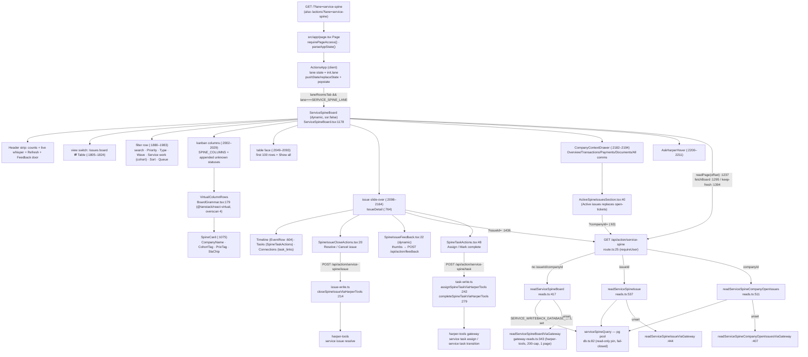

# Agent 1 — Service Spine: Source Route & UI Behavior

Audit of the `?lane=service-spine` surface in **Tatch-AI/harper-coi-workbench** at pinned commit
`718064e5dd1d78f02d4d54a3a0a5d8525fac83e4` (main, 2026-08-18 20:09:26 -0700), read-only checkout at
`/tmp/hcw-audit-718064e5`. All file paths and line numbers below refer to that commit. Code-only audit:
no DB access, no live-app access.

---

## 1. How `?lane=service-spine` selects the lane

### 1.1 Lane registry (data, not JSX)

- `src/lib/lanes.ts:110` — `export const SERVICE_SPINE_LANE = "service-spine"`.
- `src/lib/lanes.ts:1169–1186` — the `LANES` entry: `id: SERVICE_SPINE_LANE` (1178), `label: "Service spine"` (1179), `team: "Service team"` (1180), `status: "live"` (1181), `actions: []` (1184), `areas: []` (1185). The blurb (1182–1183) reads verbatim: *"The service agent's issue ledger, live: every issue on the spine with its status, priority, and company; the tasks under it (agent- and human-owned); and the append-only event timeline connecting them. Read-only. A monitor over the spine, not a workbench; nothing here sends, assigns, or resolves."* — **see §8.1: this "Read-only" copy contradicts shipped behavior.**
- Rail position: `railLanes()` (`src/lib/lanes.ts:1400–1418`) emits `LANES` order minus pipeline constituents and tab-surfaced lanes; `menuRailLanes()` (`:1425–1427`) additionally filters `isLaneMenuHidden` (`:1373–1376`, hides only `service-v2`). Service spine therefore sits **directly below Service agent** in every menu-shaped surface. Pinned by `tests/service-spine-lane.test.tsx:111–120` (`ids.indexOf(SERVICE_SPINE_LANE) === ids.indexOf(SERVICE_AGENT_LANE) + 1`, status `"live"`, label `"Service spine"`, `laneRailChildren(SERVICE_SPINE_LANE) === []`).
- Flat lane: `laneRailChildren` returns `[]` for it (`src/lib/lanes.ts:2078–2081` — "the spine browser IS the door. No child faces.").
- Rail icon: `Waypoints` (`src/components/actions/ActionsApp.tsx:907`, `LANE_ICON[SERVICE_SPINE_LANE]`).

### 1.2 URL parsing (`parseAppState`)

Both doors — `src/app/page.tsx:22–60` (`Page`, `dynamic = "force-dynamic"`) and `src/app/actions/page.tsx` — call `requirePageAccess()` then `parseAppState(q)` (`src/app/page.tsx:27,40`) and pass the result to `ActionsApp` as `initialUrlState`.

`src/lib/actions/url-state.ts`:

- `FIRST_VISIT_LANE = "home"` (`:139`); `DEFAULT_APP_URL_STATE` (`:141–147`) lands on Home. (Note: `DEFAULT_LANE = "service"` at `src/lib/lanes.ts:1216` exists but the URL parser's first-visit target is `home`.)
- `KNOWN_LANES` (`:155`) is **derived** from the registry: `new Set(["home", "reworks", UNIFIED_LANE, ...LANES.map(l => l.id)])` — so `service-spine` is a legal lane id by construction.
- Lane resolution (`parseAppState`, `:294–302`): manager-address → `"service"`; pipeline legacy → unified; legacy redirects (`resolveLegacyLane`, `:193–223`); else `KNOWN_LANES.has(laneRaw) ? laneRaw : FIRST_VISIT_LANE`. **An unknown/invalid `?lane=` degrades to Home, never a 404/crash** (`:246–250` comment states the rule).
- Area validation (`:322–330`): validated against `validAreaFilterIds(lane)` (`src/lib/lanes.ts:1801`). For `service-spine` (no areas, no rail children) the valid set is `{"all"}`, so **any `?area=` value on this lane degrades to `"all"`**.
- Other parsed slots (`item`, `w`, `view`, `f`, `tab`) parse app-wide; §3.2 covers which of them this lane actually consumes (short answer: none).

### 1.3 Auth gating

- Page level: `requirePageAccess()` (`src/lib/auth.ts:216–226`) — Clerk session required, redirect to `/sign-in`; `EMPLOYEE_ONLY` (default true, `:11`) restricts to `@harperinsure.com` (`isHarperEmail`, `:167–172`). Bypasses: `DEV_BYPASS` (`:18`, never in production, requires `DEV_AUTH_BYPASS=true`) and `PREVIEW_PUBLIC` (`:30–145`, the synthetic sandbox; every live credential kills it — including `SERVICE_WRITEBACK_DATABASE_URL` at `:75`, added specifically because the spine route serves live service-ledger rows on `requireUser()` alone; pinned by `tests/service-spine-lane.test.tsx:795–807`).
- API level: every spine route re-gates with `requireUser()` (`src/lib/auth.ts:189–212`) — `src/app/api/action/service-spine/route.ts:26–27`, `…/task/route.ts:34,80`, `…/issue/route.ts:23,38`. The two write routes additionally refuse `isPublicPreview()` with 403 and "Nothing was changed." (`task/route.ts:40–45,85–94`; `issue/route.ts:25–30,40–49`).
- **No per-lane auth**: the lane is `status: "live"`, ungated ("Ungated: the lane is a monitor", `src/lib/lanes.ts:108–109`); there is no lane-level allowlist or feature flag. No `laneComingSoon` gate applies (`src/lib/lanes.ts:1462–1464`).

### 1.4 Environment variables / flags (as they affect this lane)

| Variable | Effect | Evidence |
|---|---|---|
| `SERVICE_WRITEBACK_DATABASE_URL` | Direct read pool for `service.*` (BigBrother primary). Absent → harper-tools gateway fallback. Presence kills `PREVIEW_PUBLIC`. | `src/lib/service-spine/db.ts:20–24`; `src/lib/service-spine/reads.ts:421–424`; `src/lib/auth.ts:75`; `config/env-manifest.json:2971–2980` (the manifest entry names both consumers) |
| `HARPER_TOOLS_BASE_URL` / `HARPER_TOOLS_MCP_URL` + `HARPER_TOOLS_API_KEY` | The gateway credential: enables the fallback read path AND the write doors (`spineTaskWriteConfigured` / `spineIssueCloseConfigured` are exactly `harperToolsConfigured()`). | `src/lib/service-spine/reads.ts:231–235` (`serviceSpineConfigured`); `src/lib/service-spine/task-write.ts:62–64,72–77`; `src/lib/service-spine/issue-write.ts:63–65,73–78` |
| `HARPER_TOOLS_ENABLE_SERVICE_ISSUE_WRITE` (far side, default off), `HARPER_TOOLS_SERVICE_ISSUE_WRITE_DRY_RUN` (far side, default on) | Gate live application of assign/complete/resolve/cancel **on the harper-tools side**, not in this repo's env manifest. Held writes come back `blocked`/`dry_run` and render as "…not turned on for this deploy yet. Nothing was changed." | `src/lib/service-spine/task-write.ts:10–15,76,113–126`; `src/lib/service-spine/issue-write.ts:10–14,77,109–118` |
| `EMPLOYEE_ONLY`, `DEV_AUTH_BYPASS`, `PREVIEW_PUBLIC` | Page/API access as in §1.3. | `src/lib/auth.ts:11,18,30–145` |
| Ask Harper flag | `askHarperEnabled()` resolved server-side, threaded `Page → ActionsApp → ServiceSpineBoard` for the account drawer's Ask door only. | `src/app/page.tsx:50`; `ActionsApp.tsx:10665`; `ServiceSpineBoard.tsx:1186–1188,1582–1592,2200–2211` |

There is **no** `SERVICE_SPINE_*` env var; the retired dedicated slot is pinned dead (`tests/service-spine-lane.test.tsx:806` asserts `auth.ts` does not mention `SERVICE_SPINE_DATABASE_URL`).

### 1.5 Mount inside ActionsApp

- `src/components/actions/ActionsApp.tsx:6759` — `const init = initialUrlState ?? DEFAULT_APP_URL_STATE;` and `:6864` — `const [lane, setLane] = useState<string>(init.lane);`
- The queue-build effect **skips** this lane: `if (lane === SERVICE_SPINE_LANE) { buildGenRef.current++; return; }` (`:7860–7863`) — self-contained, "no queue build exists for the lane". Mechanically pinned by `tests/service-spine-copy-and-render-bounds.test.tsx:497–511` (regex over the source + lane declares no areas/actions + `dedupe-facet-law.data.json` lists `service-spine` under the reworks facet's vacuous coverage).
- Render guard: `laneRoomsTab` (`:10025–10026`, true when no tool tab owns the room) and the mount at `:10661–10668`:

```10661:10668:/tmp/hcw-audit-718064e5/src/components/actions/ActionsApp.tsx
          {laneRoomsTab && lane === SERVICE_SPINE_LANE && (
            <ServiceSpineBoard
              viewerName={viewer.name}
              viewerEmail={viewer.email}
              askHarperEnabled={askHarperEnabled}
              onAskHarper={openAskHarper}
            />
          )}
```

- The generic `LaneView` explicitly excludes the lane (`:10746`). The board is a lazy chunk: `const ServiceSpineBoard = dynamic(() => import("./ServiceSpineBoard"), { ssr: false, loading: laneSkeleton })` (`:362–365`) — off the `/actions` first-load JS budget (also asserted in the perf receipt's prose, `tests/service-spine-paging-performance-receipt.test.tsx:38–40`).
- Because the lane has no queue build, `laneCounts["service-spine"]` is never written by the lane's own path (`setLaneCounts` fires from queue loads, `ActionsApp.tsx:7985`), so the rail/rooms door renders without a count pill (count renders only when `counts[l.id] != null && > 0`, `:2134`; rail door `:1544`).

---

## 2. Component graph

### 2.1 Mermaid — route → components → hooks → data functions



### 2.2 File inventory (everything rendered for the lane)

| Piece | File : symbol |
|---|---|
| Server page (both doors) | `src/app/page.tsx:22 Page`; `src/app/actions/page.tsx` (same contract) |
| App shell / lane switcher | `src/components/actions/ActionsApp.tsx:6697 ActionsApp` (mount `:10661`) |
| Top-level board (whole lane UI) | `src/components/actions/ServiceSpineBoard.tsx:1178 default ServiceSpineBoard` |
| Kanban card | `ServiceSpineBoard.tsx:1075 SpineCard` |
| Table row (list mode) | inline in board `:2049–2093` (no separate component) |
| Column virtualizer | `src/components/actions/BoardGrammar.tsx:179 VirtualColumnRows` (overscan 4 `:172`, row estimate 160px `:173`) |
| Issue detail slide-over | `ServiceSpineBoard.tsx:764 IssueDetail`; event row `:604 EventRow`; tech fold `:553 MetaDetails`; task chip `:581 TaskChip` |
| Assignment/completion controls | `src/components/actions/SpineTaskActions.tsx:48 SpineTaskActions` (+ `:41 isOpenHumanTask`); roster via `PortaledAssignMenu` (`src/components/actions/AssignMenu.tsx`) |
| Resolve/Cancel issue | `src/components/actions/SpineIssueCloseActions.tsx:20 SpineIssueCloseActions` (+ `:16 isOpenIssueStatus`) |
| Thumbs feedback | `src/components/actions/SpineIssueFeedback.tsx:22 SpineIssueFeedback` (dynamic import in board `:47–50`) |
| Account slide-over | `src/components/actions/CompanyContextDrawer.tsx:146` (tabs `Overview/Drafts?/Transactions/Payments/Documents` + `All comms`, `:82–90`); body `CompanyContextTabs.tsx:398–399` swaps in… |
| Account "Active issues" list | `src/components/actions/ActiveSpineIssuesSection.tsx:40 ActiveSpineIssuesSection` |
| Ask Harper corner door | `src/components/actions/AskHarperHover.tsx` (mounted `ServiceSpineBoard.tsx:2200–2211`) |
| Styles (scoped design system) | `src/components/actions/ServiceSpineBoard.styles.ts:27 styles`, `SPINE_LIGHTFIELD_CSS` (string stylesheet scoped under `.ssp-root`, header comment `:1–25`) |
| Labels / terminal vocabulary | `src/lib/service-spine/labels.ts` (`ISSUE_TERMINAL_STATUSES :22`, `STATUS_LABELS :28`, `statusLabel :42`, `issueTypeLabel :46`, `eventKindLabel :52`) |
| Queue-picker law | `src/lib/service-spine/my-queue.ts` (`SPINE_QUEUE_MODES :102`, `issueInSpineQueue :123`, `spineQueuePeople :158`) |
| Read API | `src/app/api/action/service-spine/route.ts:25 GET` |
| Task write API | `src/app/api/action/service-spine/task/route.ts:33 GET (roster), :79 POST` |
| Issue close API | `src/app/api/action/service-spine/issue/route.ts:22 GET, :37 POST` |
| Reads (direct pool) | `src/lib/service-spine/reads.ts` (`readServiceSpineBoard :417`, `readServiceSpineIssue :537`, `readServiceSpineCompanyOpenIssues :511`) |
| Reads (gateway fallback) | `src/lib/service-spine/gateway-reads.ts` (`readServiceSpineBoardViaGateway :343`, `…IssueViaGateway :444`, `…CompanyOpenIssuesViaGateway :407`) |
| DB pool | `src/lib/service-spine/db.ts` (`serviceSpineQuery :82`, read-only pin `:67–80`) |
| Writes | `src/lib/service-spine/task-write.ts`, `src/lib/service-spine/issue-write.ts` |

**Not part of this lane** (despite the name): `src/components/actions/ServiceTicketBoard.tsx` is the *Service* lane's ticket board; its "spine" is `buildWorkNextSpine` from `src/lib/service/ticket-narrative.ts` (Mine-first work ordering over service_logs tickets — see `ServiceTicketBoard.tsx:16,155`) and its `MINE_LENS_KEY = "harper-service-spine:v1:mine"` (`:37`) is just a localStorage key name. See §8.9.

`src/lib/service/active-service.ts` (also listed as an entry point) belongs to the Service lane's Active Service board (`ActiveServiceBoard.tsx`), not this lane; the spine board never imports it.

---

## 3. State model

### 3.1 React state inside `ServiceSpineBoard` (all `useState`/`useRef`, no context, no reducer)

| State | Type / initial | Purpose | Line |
|---|---|---|---|
| `board` | `BoardState` = `loading \| failed{reason} \| ready{summary, issues, paging, pages: Map<offset, rows[]>}` | The whole list read | `:200–213, :1190` |
| `detail` | `DetailState` = `closed \| loading{issueId} \| failed{issueId, reason} \| ready{issueId, detail}` | Slide-over | `:232–236, :1191` |
| `companyContext` | `CompanyContextTarget \| null` | Account drawer | `:1194` |
| `view` | `"board" \| "table"`, initial `"board"` | Face toggle | `:1195` |
| `filters` | `SpineFilters { search:"", priority:"", type:"", wave:"", sort:"recency", queue:"all", cohort:"" }` | All narrowing | `:1160–1171, :1196–1204` |
| `tableAll` | `false` | Table "Show all" | `:1205` |
| `offsets` | `number[]`, initial `[0]` | The loaded window (Load more appends) | `:1209` |
| `loadingMore`, `reloadKey`, `detailReloadKey`, `lastUpdated`, `flashIds` | misc | `:1210–1214` |
| refs: `prevColsRef` (movement detector), `boardRef`, `missingRef` (failed offsets), `rereadWindowRef`, `flashTimerRef` | — | `:1216–1227` |

Per-chip clock: `SlaChip` holds its own `nowMs` state + 60s interval, only when the due date parses and the issue is non-terminal (`:383–405`).
`IssueDetail` holds `allEvents` (timeline show-all), `tab` (`"timeline" | "tasks" | "connections"`), `flashTaskId` (`:777–780`); panels stay mounted behind `[hidden]` so state survives tab switches (`:890–892`).

### 3.2 URL state synchronization — what is and is not addressable

- **Lane is URL state.** ActionsApp writes `?lane=service-spine` via `history.pushState` on lane change / `replaceState` otherwise (`ActionsApp.tsx:8574–8639`; push at `:8634`). Back/Forward re-parses the URL in the `popstate` handler (`:8642–8736` → `setLane(s.lane)` `:8667`). So browser Back **walks lanes** — leaving the spine lane restores the previous lane.
- **Nothing inside the board is URL state.** `view` (board/table), all seven filters, `tableAll`, the loaded window (`offsets`), and the open issue (`detail`) are plain component state; none serialize. The app-level `?view=table` lens applies only where `isBoardScope(lane, area)` is true (`src/lib/actions/board-grammar.ts:55–67`), and `service-spine` is not in that predicate — so the lens param is never written for this lane. `?item=`, `?w=`, `?f=` parse app-wide (`url-state.ts`) but the spine mount receives none of them (`ActionsApp.tsx:10661–10668` passes only viewer + Ask Harper props).
- **Consequences** (verified in code, flagged in §8): a refresh or shared link always lands on the default face (board view, all filters, no open slide-over); browser Back does not close the slide-over (only Esc `:1459–1466`, the scrim `:2100–2105`, or the close button `:820–829` do); pagination resets to `offsets=[0]` on every mount.
- **Nothing persists across navigation** for this lane: no `localStorage`/`sessionStorage` key is read or written by `ServiceSpineBoard` (the per-lane filter memory machinery in ActionsApp — `queueFiltersPrefKey` etc., `:9844–9845` — belongs to queue lanes and is never consulted by this board). Unmount (lane switch) discards everything; the roster cache in `SpineTaskActions.tsx:16–18` (60s TTL module-level) is the sole in-memory survivor.

### 3.3 Selected-issue state

`openDetail(issueId)` sets `detail = {state:"loading", issueId}` (`:1567`); an effect fetches `/api/action/service-spine?issueId=…` with a 20s timeout (`:1436–1456`). Opening the account panel closes the issue panel and vice versa — "One surface at a time" (`:1569–1578`). The detail's refresh button re-reads the issue *and* re-reads the whole board window (`onRefresh`, `:2148–2157`) so list tallies can't go stale after a write.

---

## 4. Data flow & pagination model (client side)

- **Page read**: `readPage(offset)` (`:1237–1287`) fetches `GET /api/action/service-spine?offset=N`, 60s `AbortSignal.timeout`. Page 0 must carry `summary` (`:1251` — "Page one without a summary is a broken answer"); continuations carry `summary: null`.
- **Window read**: `fetchBoard(window, held)` (`:1295–1338`) reads all offsets in parallel, folds pages by issue id (`foldPages` `:224–230`, earlier page wins a collision — the keep-fresh tick re-reads page one so its copy is fresher; pinned by `tests/service-spine-page-fold-and-retry-pin.test.tsx:84–121`). First page failing = named board failure; a later page failing only shortens the window with a note (`:1305–1312, :1331–1333`).
- **Server page size**: `SPINE_ISSUE_PAGE = 500` (`src/lib/service-spine/reads.ts:324`; pinned to exactly 500 by `tests/service-spine-copy-and-render-bounds.test.tsx:419–421`). **Offset-based**, not cursor: `ISSUES_SQL` ends `ORDER BY i.updated_at DESC, i.id DESC LIMIT $2 OFFSET $3` (`reads.ts:372–374`).
- **Auto-walk**: after first paint the board loads the next page by itself every `SPINE_AUTO_WALK_GAP_MS = 250` ms (`:285`) up to `SPINE_AUTO_WALK_PAGES = 4` pages (`:281`); past the budget, Load more is manual (`autoWalking` `:1664–1665`, effect `:1668–1672`). Pinned in `tests/service-spine-paging-performance-receipt.test.tsx:331–419` (walk finishes 120/50 book with offsets `[0,50,100]`; stops at budget with `[0,50,100,150]`; a failed page is attempted once, never auto-retried).
- **Load more** (`loadMore`, `:1631–1656`): retries a *failed* offset alone before asking for a new page (`missingRef`); when the receipt promises more but there's no new offset to ask (`pageToAsk == null`), it re-reads the whole window instead of stranding on "Loading". `remaining = counted − issues.length` (`:1600`) — the ledger's own count, not `hasMore`, decides whether the control shows.
- **Keep-fresh polling**: `SPINE_REFRESH_MS = 12_000` (`:240`); the interval re-reads **page 0 only**, folds it over held pages, keeps the walked window and the note for missing pages (`:1394–1433`). Pinned: one tick = one request however far the walk went (`paging-performance-receipt.test.tsx:421–478`).
- **Refresh button** re-reads every loaded offset from the top (`rereadWindowRef.current = true`, `:1774–1786`).
- **Flash on change**: `applyBoard` diffs `spineColumnOf` per issue against `prevColsRef`; new/moved cards flash `FLASH_MS = 2_600` ms (`:1342–1363`); never on first paint.
- **Gateway fallback pagination**: single page only, `GATEWAY_ISSUE_LIST_CAP = 200` (`gateway-reads.ts:42`); `offset > 0` serves `[]` with no gateway call (`:354–359`); `hasMore: false` always; a saturated page carries the exact note *"this board is on a limited connection that serves at most 200 issues at a time and cannot page further, so the ledger may hold more than these 200. Connect the direct service database to load and page every issue."* (`:385–398`). Pinned by `tests/service-spine-gateway-list-ceiling.test.ts` (never claims truncation, asks `--limit 200`, offers no second page).

---

## 5. Exact enums, labels, and copy (as written in code)

### 5.1 Kanban columns — `SPINE_COLUMNS` (`ServiceSpineBoard.tsx:297–304`)

| id | label | note | alwaysShown |
|---|---|---|---|
| `open` | `Open` | `Being worked. No wait on anyone.` | `true` |
| `waiting_customer` | `Waiting on customer` | `The next move is the customer's.` | `true` |
| `waiting_third_party` | `Waiting on third party` | `The next move is a carrier's / UW's / other third party's.` | `true` |
| `blocked` | `Blocked` | `Stuck. Needs an unblock before any move.` | `false` |
| `closure-proposed` | `Closure proposed` | `The agent proposed closing; awaiting the confirm.` | `true` |
| `closed` | `Closed` | `Resolved or cancelled: the terminal states.` | `true` |

Status → column mapping (`spineColumnOf`, `:310–314`): terminal (`resolved`/`cancelled`) → `closed`; else `closureProposed === true` → `closure-proposed`; else the status verbatim. **An unknown status becomes its own appended column** labeled via `statusLabel` with note `A status outside the declared set. Read as words, never renamed.` (`:1560–1563`). Pinned by `tests/service-spine-lane.test.tsx:323–344` (including `somewhere_new` → own column) and `tests/pr1754-spine-terminal-status-single-source-pin.test.ts:30–42` (an unknown status like `escalated` is NOT terminal).

### 5.2 Status vocabulary — `STATUS_LABELS` (`src/lib/service-spine/labels.ts:28–35`)

`open → "Open"`, `waiting_customer → "Waiting on customer"`, `waiting_third_party → "Waiting on third party"`, `blocked → "Blocked"`, `resolved → "Resolved"`, `cancelled → "Cancelled"`. Fallback: `status.replace(/_/g, " ")` (`:42–44`). Terminal set: `ISSUE_TERMINAL_STATUSES = ["resolved", "cancelled"] as const` (`:22`) — the single source; `tests/pr1754-spine-terminal-status-single-source-pin.test.ts:44–76` walks the source tree and asserts the pair is spelled **only** in `labels.ts`.

### 5.3 Filter controls (filter row `:1880–1983`) — exact option strings

- **Search** input placeholder: `Search company, goal, type, correlation key…`; aria-label `Search the issues`.
- **Priority** select: `Priority: all` (value `""`), then options **derived from loaded rows** — `[...new Set(issues.map(i => i.priority))].sort()` (`:1468–1471`); values render verbatim (data carries `P0`/`P1`/`P2`-style strings; nothing hardcodes the set).
- **Type** select: `Type: all` (value `""`), options derived from loaded rows' `issueType` keys; **option text is `issueTypeLabel` (underscores → spaces) while the value stays the stored key** — e.g. value `coi_request`, text `coi request`. Pinned by `tests/service-spine-issue-type-and-sla-timers.test.tsx:115–128`.
- **Wave** select (renders only when any row's correlation key yields a wave): `Wave: all` (value `""`), options like `0731` — `waveOf` parses the key's tag prefix `spine-prod-20260731:…` → `MMDD` (`:368–373`).
- **Service work (cohort)** select (`data-testid="service-spine-cohort-filter"`): `Service work: all (N)` (value `""` = `SPINE_COHORT_ALL`), `Pending orders (N)` (value `"pending"`), `Active services (N)` (value `"active"`), `Others (N)` (value `"others"`). Law: `spineCohortOf` (`:739–743`) — `pendingOrder === true → "pending"`, `=== false → "active"`, else `"others"`. Card tag renders only for pending/active (`CohortTag :745–761`); Others is filter-only. Pinned by `tests/service-spine-lane.test.tsx:429–547`.
- **Sort** select: `Sort: recency` (value `"recency"`, default) and `Sort: priority` (value `"priority"`).
- **Queue** select (`data-testid="service-spine-queue"`) — `SPINE_QUEUE_MODES` (`my-queue.ts:102–108`), closed control shows live mode **with count**:
  - `all` → `Queue: all`
  - `mine` → `Queue: mine` (offered only when viewer name/email known, `:1489–1503`)
  - `human` → `Queue: human`
  - `ai` → `Queue: AI`
  - `human+ai` → `Queue: human + AI`
  - plus an `<optgroup label="Someone's queue">` with `person:<Name>` options built from loaded rows' `openHumanAssignees` (names only — tokens containing `@` are dropped; most-loaded first; `spineQueuePeople` `:158–174`).
  - Matching law (`issueInSpineQueue`, `:123–144`): `human` = `humanOpen > 0`; `ai` = `agentOpen > 0`; `human+ai` = either (union, **not** all — an idle issue stays out); `mine` = any open-human assignee matches viewer name (via `viewerNameMatches`) or exact email; `person:X` = exact lowercased token equality. All pinned in `tests/service-spine-lane.test.tsx:612–791`.

### 5.4 Task status / owner values

- Task open test: `ownerKind === "human" && status !== "done" && status !== "cancelled"` (`SpineTaskActions.tsx:41–43 isOpenHumanTask`; `my-queue.ts:9 TASK_CLOSED = new Set(["done","cancelled"])`; reads side `reads.ts:31 TASK_CLOSED = ["done","cancelled"]`).
- Task status pill classes recognize: `done`, `in_progress`, `waiting`, `todo`, `cancelled` (`ServiceSpineBoard.tsx:544–550`); dot classes `:537–542`.
- Owner kinds recognized: `agent`, `human` (aggregates in `reads.ts:348–351`; tallies in `gateway-reads.ts:252–263`).
- Complete posts `status: "done"` through `service task transition` (`task-write.ts:294–302`).

### 5.5 Fixed operator copy (exact strings)

- Cap/gap strip: `loaded {N} of {M} issues.` + (walking) `The rest are still coming in, a page at a time. Search and filters cover what has landed so far.` / (stopped) `Search and filters cover the loaded set until the rest are in.`; button `Load {min(remaining, limit)} more` / `Loading` (`:1831–1849`).
- Walk trade note (`SPINE_WALK_NOTE`, `:287–288`, shown when `counted > SPINE_WALK_TRUSTED_PAGES(=2) × limit`): *"This list arrives a page at a time, whether the board is still reading it or you press for the rest. On a ledger this long, an issue updated while you read moves to the top and can sit on a page that already loaded. Refresh reads from the top again."*
- Doors hint: `Click an account name for that account and its open issues. Click an issue for its timeline, and to assign or complete its open human tasks.` (`:1870–1875`).
- Failure: `The spine read failed ({reason}).`; empty: `No issues on the spine yet.` vs `No issues match this filter.`; column empty: `No issues in this state` (`:1986–1996, :2011–2012`).
- Partial window: `part of the list did not come back ({reason}). These are the issues that loaded. Load more reads the rest.` (`:1331–1333`).
- Header title tooltip `:1702–1704`; whisper `assign + complete, when turned on` (`:1705`); live receipt `live · refreshed {time}` (`:1762–1773`).
- Feedback door href: `/feedback?lane=service-spine&locked=1` (`SPINE_FEEDBACK_DOOR_HREF`, `:52`).
- Wiring notes (unarmed deploys): task — `Assign and Mark complete are not turned on for this deploy yet. Nothing was changed.` (`task-write.ts:67–69`); issue — `Resolve and Cancel are not turned on for this deploy yet. Nothing was changed.` (`issue-write.ts:68–70`).
- Copy register is itself pinned: no em dash anywhere on the painted board/panel; the lane blurb and column notes lint clean (`tests/service-spine-copy-and-render-bounds.test.tsx:152–170`); the gateway ceiling note and walk note must pass `lintOperatorCopy` and never leak `harper-tools|SERVICE_WRITEBACK|offset|keyset|LIMIT` (`gateway-list-ceiling.test.ts:62–66`; `paging-performance-receipt.test.tsx:480–493`).

---

## 6. Behavior inventory

| # | Feature | Behavior | Evidence (file : symbol / line) |
|---|---|---|---|
| 1 | Lane selection | `?lane=service-spine` legal via registry-derived `KNOWN_LANES`; invalid lane → Home; invalid `?area=` on this lane → `"all"` | `url-state.ts:155 KNOWN_LANES`, `:294–330 parseAppState`; `lanes.ts:1178` |
| 2 | Lane door | Rail entry directly below Service agent, flat (no children), icon `Waypoints`, no count pill (no queue build) | `lanes.ts:1400–1427`, `:2078–2081`; `ActionsApp.tsx:907, :7860–7863, :1544` |
| 3 | Mount | Lazy chunk, `ssr:false`, `laneSkeleton` while loading; renders only when no tool tab owns the room | `ActionsApp.tsx:362–365, :10025–10026, :10661–10668` |
| 4 | Default face | Kanban ("Issues board"); Table one toggle away; toggle is local state, not URL | `ServiceSpineBoard.tsx:1195, :1805–1824`; `board-grammar.ts:55 isBoardScope` (spine absent); test `service-spine-lane.test.tsx:393–427` |
| 5 | Board read | `GET /api/action/service-spine?offset=N`; page 0 carries whole-ledger summary; continuations `summary:null`; 60s client timeout | `ServiceSpineBoard.tsx:1237 readPage`; `route.ts:52–74`; `reads.ts:417–505` |
| 6 | Page size / order | 500 rows/page, `ORDER BY updated_at DESC, id DESC LIMIT/OFFSET`; offset past count reads nothing (offset wall) | `reads.ts:324 SPINE_ISSUE_PAGE, :372–374 ISSUES_SQL, :475`; test `copy-and-render-bounds:483–494` |
| 7 | Auto-walk | Self-loads up to 4 pages, 250ms apart, then leaves Load more; failed page = one attempt, manual retry | `ServiceSpineBoard.tsx:281 SPINE_AUTO_WALK_PAGES, :285, :1625–1672`; test `paging-performance-receipt:331–419` |
| 8 | Load more | Shows while `counted − loaded > 0` (count-based, not `hasMore`); retries failed offset alone; re-reads window when receipt promises more with nothing to ask | `ServiceSpineBoard.tsx:1594–1656`; tests `copy-and-render-bounds:246–297`, `page-fold-and-retry-pin:124–192` |
| 9 | Polling | 12s keep-fresh tick re-reads page 0 only; folds over held pages; transient failure never blanks a good board | `ServiceSpineBoard.tsx:240 SPINE_REFRESH_MS, :1383–1433`; test `paging-performance-receipt:421–478` |
| 10 | Manual refresh | Header `Refresh` re-reads every loaded offset from the top; slide-over `refresh` re-reads issue + window | `ServiceSpineBoard.tsx:1774–1786, :2148–2157` |
| 11 | Change flash | Card that arrived or changed column flashes 2.6s (`cardFlashing`), never on first paint | `ServiceSpineBoard.tsx:242 FLASH_MS, :1342–1363` |
| 12 | Search | Case-insensitive substring over: companyName, companyId, id, goal, issueType (+ its label), status (+ its label), priority, correlationKey, latestSummary, origin. **No debounce** — filters loaded rows synchronously per keystroke | `ServiceSpineBoard.tsx:420–441 issueMatchesSearch, :1884–1890` |
| 13 | Filters | Priority / Type / Wave / Cohort / Queue — all client-side cuts over **loaded** rows; option sets derived from loaded rows (see §5.3) | `ServiceSpineBoard.tsx:1468–1541` |
| 14 | Sorting | `recency` (default) = server order (updated_at DESC, folded); `priority` = `a.priority.localeCompare(b.priority)` then updatedAt DESC (lexicographic ⇒ P0 first) | `ServiceSpineBoard.tsx:1533–1540, :1946–1953` |
| 15 | Filtered count | `{visible} of {loaded} issues` beside filters; column headers count filtered items; both follow every cut | `ServiceSpineBoard.tsx:1979–1981, :2009`; tests `service-spine-lane:524–528, :710–716` |
| 16 | Header counts | `issues` = Σ summary.issuesByStatus (whole ledger, direct path); per-status dots (n>0 only); `agent tasks open/total`; `human tasks open/total`; `events` total; `suppressed` = events with `issue_id IS NULL` | `ServiceSpineBoard.tsx:1594–1595, :1707–1750`; `reads.ts:437–489` |
| 17 | Loaded receipt | `{N} issue(s) loaded` under header = folded window size | `ServiceSpineBoard.tsx:1796–1800` |
| 18 | Kanban virtualization | Cards are direct children of `VirtualColumnRows` (one card = one virtual row; overscan 4; 160px estimate); 600-card column paints <100 DOM rows | `BoardGrammar.tsx:172–235`; `ServiceSpineBoard.tsx:2014–2024`; test `copy-and-render-bounds:173–183` |
| 19 | Table bound | First 100 rows (`SPINE_TABLE_PAGE`), banner `Showing the first 100 of {V} rows` + `Show all {V}`; no virtualizer on table | `ServiceSpineBoard.tsx:251, :1544–1545, :2034–2048`; test `copy-and-render-bounds:185–196` |
| 20 | Issue open | One click anywhere on card/row opens slide-over (no navigation); Esc, scrim, or `close` closes; open board stays painted beneath | `ServiceSpineBoard.tsx:1567, :1459–1466, :2096–2164`; test `service-spine-lane:559–595` |
| 21 | Slide-over content | Eyebrow (company, cohort tag, `issue #id`, priority, status pill, type label, `blocking` pill, `wave NNNN`, opened time, SLA chip); goal; Latest summary / Last communication / Resolution boxes; feedback block; issue-meta fold; Resolve/Cancel; tabs `Timeline (N) / Tasks (N) / Connections` | `ServiceSpineBoard.tsx:764–1070` |
| 22 | Timeline | Oldest-first; bounded to newest 40 (`SPINE_TIMELINE_PAGE`) with `Showing the newest {X} of {eventCount} events.` + `Show all {loaded} loaded`; server cap 500 (`EVENT_ROW_CAP`, gateway 100) reported as `Older events past the read's cap stay in the spine.` | `ServiceSpineBoard.tsx:252, :801–803, :926–958`; `reads.ts:325, :397–404`; tests `copy-and-render-bounds:299–359` |
| 23 | Event rendering | Kind icon+tone map; body quote; envelope (to/channel/subject/body); human k/v pairs (≤400 chars) inline; technical keys (id/key/ref/uuid/hash/token/correlation/gmail/wake/thread/dedupe/checksum regex + UUID/opaque shapes) folded behind `N ids & metadata`; `raw payload` behind a details fold; task chips jump to Tasks tab and flash the row | `ServiceSpineBoard.tsx:443–535, :553–599, :604–683, :788–798` |
| 24 | Tasks table | Columns `# / Title / Owner / Status / Assignee / Actions / Created`; gate label pill and `laneSkill` code under title; open human tasks get Assign (Assignee col) and Mark complete → confirm (Actions col); agent/closed tasks display-only assignee | `ServiceSpineBoard.tsx:960–1041`; `SpineTaskActions.tsx:48–286` |
| 25 | Assign flow | Roster from `GET /api/action/service-spine/task` (60s client cache; contested names stripped of id+email so far door refuses ambiguity); posts `{action:"assign", taskId, assignee: agentId ?? email ?? name}`; optimistic name; proven refusal rolls back; unknown outcome **locks** the control (`unresolved`) until panel re-read | `SpineTaskActions.tsx:16–39, :103–161`; `task/route.ts:33–77, :79–203`; tests `spine-task-assignee-cell`, `pr1754-pre-execution-rejection-not-unknown-pin` |
| 26 | Complete flow | Two-step (`Mark complete` → `Confirm complete`/`Cancel`); posts `{action:"complete", taskId}`; same unknown-outcome lock | `SpineTaskActions.tsx:163–196, :222–263` |
| 27 | Resolve/Cancel issue | Only on non-terminal status (`isOpenIssueStatus`); requires summary ≥3 chars (max 4000); posts `{action:"resolve"|"cancel", issueId, summary}` → harper-tools `service issue resolve`; held/refused/unknown map to exact copy; unknown locks Confirm+Back for panel lifetime | `SpineIssueCloseActions.tsx:16–173`; `issue/route.ts:37–145`; `issue-write.ts:214–249`; tests `service-spine-issue-close-lock-pin`, `service-spine-issue-close-route-pin` (`closed`→200; hold→200 ok:false; refusal→409; unknown→502+unknownOutcome; unwired→503; preview→403) |
| 28 | Feedback | Thumbs up/down on issue (block, under summaries) and per task (inline, Actions col); down requires comment; posts through `/api/action/feedback` as `verdict: "other"` + `spine_thumb` (never stamps playbook ledger); 10s undo window; board header `Feedback` door → `/feedback?lane=service-spine&locked=1` | `SpineIssueFeedback.tsx:22–285`; `ServiceSpineBoard.tsx:52, :875–877, :1027–1032, :1787–1794`; tests `spine-issue-feedback-door`, `spine-issue-feedback-payload-pin` |
| 29 | Account navigation | Company name on card / table row / eyebrow is a keyboard-activatable span (not nested button) → opens `CompanyContextDrawer` (same drawer as Service work: Overview / Transactions / Payments / Documents / All comms), mounted **outside** `.ssp-root` (style-scoping note `:2168–2181`), with `showActiveSpineIssues` replacing the legacy open-tickets list and `hideServiceTasks` on Transactions | `ServiceSpineBoard.tsx:685–723 CompanyName, :2182–2194`; `CompanyContextDrawer.tsx:82–90, :421, :436`; `CompanyContextTabs.tsx:398–399`; test `service-spine-account-panel:138` |
| 30 | Active issues list | `GET /api/action/service-spine?companyId=N` → openish issues only (terminal excluded), cap 50 (`COMPANY_OPEN_ISSUE_CAP`), newest-updated first; row click opens that issue's slide-over (closing the drawer); capped note `Showing the newest active issues for this account.` | `ActiveSpineIssuesSection.tsx:40–195`; `reads.ts:376–389, :511–535`; `route.ts:31–50`; `ServiceSpineBoard.tsx:1575–1578` |
| 31 | Ask Harper | Drawer Ask button + always-visible corner FAB (disabled with explanation when flag off), focus `{lane:"service", surface:"account-drawer"}` | `ServiceSpineBoard.tsx:1176, :1582–1592, :2195–2211`; test `service-spine-account-panel:269–345` |
| 32 | SLA chips | Live countdown per non-terminal issue with parseable `slaDueAt`; 60s interval per ticking chip only; `SLA in {dur}` / `SLA breached {dur}`; amber < 4h, red breached; terminal/malformed/absent → no chip, no interval | `ServiceSpineBoard.tsx:379–405 SlaChip`; tests `service-spine-sla-timer-clock-pin:99–121`, `issue-type-and-sla-timers:131–154` |
| 33 | Priority tag | Quiet dot+label; P0 red, P1 amber, others neutral | `ServiceSpineBoard.tsx:409–418 PrioTag` |
| 34 | Card anatomy | company+cohort+`#id`+priority → type kicker (+wave, +`blocking` pill) → goal (3-line clamp) → foot: SLA chip, `draft` pill (hasDraft), `closure proposed` pill (non-terminal), `agent o/t · human o/t` tallies, relative last-event time | `ServiceSpineBoard.tsx:1075–1139 SpineCard` |
| 35 | Table row anatomy | company+cohort+id+priority+status pill+blocking + SLA + rel-time → goal → meta line: type · `agent o/t` · `human o/t` · `N events` · `draft on record` · `closure proposed` | `ServiceSpineBoard.tsx:2049–2093` |
| 36 | Human vs agent progress | Card/table `agent {open}/{total}` and `human {open}/{total}` from per-issue LATERAL tallies; header totals from whole-table GROUP BY; detail derives its own from loaded tasks so panel and list can't disagree | `reads.ts:330–370, :445–463, :612–615`; `ServiceSpineBoard.tsx:1088–1090` |
| 37 | Closed items | Terminal issues render in the always-shown `Closed` column (and in Table); **no closed-item toggle exists**; the account panel excludes them entirely | `ServiceSpineBoard.tsx:297–314`; `reads.ts:385–389`; §8.3 |
| 38 | Loading state | Skeleton columns `[3,2,2,1]` cards with opacity pulse; header stat skeletons; detail panel skeleton lines | `ServiceSpineBoard.tsx:1143–1158, :1751–1760, :2114–2122` |
| 39 | Error states | Board: named failure line (never empty-board lie); detail: named failure + close; account list: message + Retry; fixed-category reasons only (server never leaks pg/statement text) | `ServiceSpineBoard.tsx:1986–1991, :2123–2143`; `reads.ts:500–504`; `ActiveSpineIssuesSection.tsx:109–116` |
| 40 | Partial states | Short window note; gateway 200-cap note; timeline read-cap note; walk-trade note past 2 pages | `ServiceSpineBoard.tsx:1831–1875`; `gateway-reads.ts:385–398` |
| 41 | Responsive | Columns fixed 336px, board scrolls horizontally (`overflow-x auto`); slide-over `min(900px, 94vw)`; `@media (max-width:760px)` tightens paddings, search goes full-width; `prefers-reduced-motion` kills animations | `ServiceSpineBoard.styles.ts:505–512, :831–845, :1140–1161` |
| 42 | Read-only wire | Direct pool pins `SET default_transaction_read_only = on` fail-closed per session (failed pin destroys the client); pool max 3, connect 8s, query 10s; GET is the read route's only verb | `db.ts:34–51, :58–80`; `route.ts:22–23`; test `service-spine-lane:809–821` |
| 43 | Audit trail | Both write routes `logAction` to the action log (`lane: "service-spine"`, channels `service_spine_task` / `service_spine_issue`), diagnostics on audit meta, never on the wire | `task/route.ts:144–171, :186–188`; `issue/route.ts:95–118` |

---

## 7. The test files as executable specifications

Service-spine lane tests at `tests/` (all verified present at the pinned commit):

| Test file | What it pins |
|---|---|
| `service-spine-lane.test.tsx` (822) | Lane registered directly below Service agent, flat+live; read folds (summary + normalized rows; cohort SQL shape; gateway humanOpen enrichment; named not-configured/transient failures); detail fold (jsonb `link_ref` → string); `spineColumnOf` mapping incl. unknown-status columns; kanban default + always-shown columns + empty `blocked` folds away; table toggle; cohort tag/filter/count coherence; named board failure; slide-over open/Esc; served-vs-counted strip + Load more; the queue picker (one `<select>`, exact labels+counts, viewer-blind boards offer no Mine); `issueInSpineQueue` truth tables; `SERVICE_WRITEBACK_DATABASE_URL` on the preview kill list; fail-closed read-only pin |
| `service-spine-gateway-list-ceiling.test.ts` (98) | Gateway fallback: saturated 200-row page names the ceiling without claiming truncation (`may hold more`, no tooling/env vocabulary, lint-clean); quiet under ceiling; asks `--limit 200`; `offset>0` serves nothing (no re-serving page one) |
| `service-spine-paging-performance-receipt.test.tsx` (505) | The performance receipt: one answer ≤ one 500-row page (382,384 B raw / 12,666 B gzip measured; ceilings 420,000 B / 16,000 B asserted); paging receipt is a flat <200 B header; payload does not grow with the book; whole-ledger aggregates computed once (continuations answer `summary:null`, still read the count); auto-walk finishes the book unpressed, stops at its 4-page budget, goes quiet on a failed page (one attempt), press resumes it; keep-fresh tick = one page per tick, holds the walked window; walk-trade note appears past `SPINE_WALK_TRUSTED_PAGES(=2)` pages and lints clean |
| `service-spine-page-fold-and-retry-pin.test.tsx` (192) | Fold prefers the fresher page (keep-fresh update to a row a retained later page still holds stale wins; one DOM row per issue); a failed continuation is retried by itself (press re-reads only that offset); the short-read note survives keep-fresh ticks until the gap closes |
| `service-spine-copy-and-render-bounds.test.tsx` (511) | No em dash reaches an operator (blurb, column notes, painted DOM); kanban rides the virtualizer one card per virtual row (600 counted, <100 painted); table bounded to first 100 with named bound + Show all; loaded-of-counted strip + Load more closes the gap and goes quiet at parity; loaded rows survive a failed later page; Load more stays reachable when folded rows < count and when a receipt promises more but serves 0; timeline bounded to newest 40 with named rest; read-capped timeline says so (`of 900 events`); `EVENT_ROW_CAP` LIMIT + window aggregates keep count honest; ssl-strip pin; `SPINE_ISSUE_PAGE === 500`; whole-book-in-one-page and multi-page walks; offset wall (no statement past the count); lane stays queue-less (facet-law exemption made mechanical) |
| `service-spine-sla-timer-clock-pin.test.tsx` (144) | SLA fixture is relative (`now + Nd`); malformed `slaDueAt` renders no chip and starts **no** interval; live chip holds a 60s interval; timeline icon tooltip reads words (`closure proposed`), never the raw token |
| `service-spine-issue-type-and-sla-timers.test.tsx` (154) | Issue type reads as words on kicker/table/eyebrow (no `coi_request` on screen); type filter shows words but filters on the stored key; SLA chip clocks only what counts down (terminal/no-SLA rows start no interval) |
| `pr1754-spine-terminal-status-single-source-pin.test.ts` (77) | `ISSUE_TERMINAL_STATUSES` is exactly `["resolved","cancelled"]`; reads re-export is the same object; every declared status answers identically across `isTerminalIssueStatus` / `isOpenIssueStatus` / `spineColumnOf`; unknown statuses are NOT terminal; **no second spelling** of the pair anywhere in spine surfaces (source-tree walk) |
| `pr1754-pre-execution-rejection-not-unknown-pin.test.ts` (207) | `HarperToolsRejectedError` (argument-validation / JSON-RPC pre-dispatch) = proven no-write → `refused`, controls stay armed; internal errors/unparseable bodies stay ambiguous → `unknownOutcome` lock; far `closed` still applies; same law on the task door |
| `service-spine-issue-close-route-pin.test.ts` (199) | Close route mapping: far `closed` → 200 ok + audit `fired:true`; far hold → 200 `ok:false` with plain wiring note; proven refusal → 409 without unknownOutcome; typed command refusal → 409 (not 502); wire throw → 502 + unknownOutcome; unrecognized far status → 502; unwired → 503 with zero door calls; public preview → 403 zero calls; only resolve/cancel; bad id / thin summary / non-JSON body → 400 before the door |
| `service-spine-issue-close-lock-pin.test.tsx` (129) | Panel lock: unknownOutcome disables Confirm+Back for panel lifetime; thrown fetch same; proven refusal re-arms; applied close reports upward; thin summary refused locally with no call; terminal issue renders no door |
| `service-spine-task-write.test.ts` (247) | `service task assign` / `service task transition` called with `confirm:true` + structured input; dry_run/blocked named without claiming applied; env names kept out of operator note; empty assignee refused pre-wire; thrown call = structured failure; upstream text scrubbed; My-queue matchers; id→person label resolution incl. email match |
| `service-spine-issue-write.test.ts` (130) | Same grammar on `service issue resolve`: confirm:true, holds named, short summary refused pre-wire, thrown call structured, typed refusal does not lock |
| `service-spine-account-panel.test.tsx` (345) | Company read excludes terminal + refuses non-integer id before any statement; account name opens the panel (not the row's issue) and queries by companyId; Active issues rows open the issue slide-over; drawer Ask Harper focus (`lane:"service"`, `surface:"account-drawer"`); flag-off keeps the parked corner door |
| `service-spine-bound-policy-single-source-pin.test.ts` (85) | `boundPolicyDealPredicate` has one spelling (shared module); both spine read faces build from it; account-stage CASE: **bound wins**, neither/company-less → NULL (nothing defaults to Active) |
| `spine-assignee-identity-shape-pin.test.ts` (68) | Assignee ids resolve by directory membership, never shape; unknown tokens pass through; legacy display names still match |
| `spine-task-assignee-cell.test.tsx` (272) | Assignee cell = named assign control for open human tasks; posts the picked desk's `internal_agents` id (email fallback); dropped answers and structured unknowns never claim "missed" (lock + re-read note) |
| `spine-issue-feedback-door.test.tsx` (196) | Header Feedback door locked to `service-spine`; thumbs under summaries post issue+company+thumb; task thumbs in ACTIONS post issue+task scope |
| `spine-issue-feedback-payload-pin.test.ts` (267) | Feedback payload: `verdict:"other"` + `spine_thumb` (no ledger stamp); thumbs-down requires comment; operator-facing labels carry no raw tokens / em dashes; the feedback read filter matches `lane=service-spine`; locked triage URL |
| `spine-account-emails-on-file.test.tsx` (283) | The account panel's emails-on-file chips (customer first, internal addresses excluded, capped-counterpart note, per-leg failure honesty) — account-drawer behavior shared with Service work |

**Name-collision warning:** these `spine`-named tests pin *other* subsystems, not this lane: `pfa-spine-pin.test.ts` (Service lane's `buildWorkNextSpine` ticket ordering), `read-spine.test.ts` + `read-spine-hydration.test.ts` (durable read-spine store), `inbox-feed-spine*.test.ts` (inbox feed builds), `binder-gate-spine-sync-pin.test.ts` (binder checkout SQL), `perf-02-spine-cold-adopt.test.ts` (queue snapshot adoption), `tool-snapshot-spine.test.ts` (analytics snapshots), `ticket-cure-spine.test.tsx`, `pr1688-active-service-spine-generation-retake-pin.test.ts` (Active Service board cache generations).

---

## 8. Ambiguities, contradictions, and gaps (flagged, not guessed)

1. **Registry blurb contradicts shipped behavior.** `lanes.ts:1182–1183` still says *"Read-only… nothing here sends, assigns, or resolves"*, while the board ships Assign / Mark complete (`SpineTaskActions`) and Resolve / Cancel (`SpineIssueCloseActions`). The board's own header comment documents the reversal as deliberate and **"PENDING DR's sign-off"** (`ServiceSpineBoard.tsx:69–81`). The lane-registry copy was not updated. Also the header whisper (`assign + complete, when turned on`, `:1705`) and title tooltip (`:1702–1704`) mention assign/complete but not Resolve/Cancel, which the panel also offers.
2. **Two different summary-count semantics by deploy path.** Direct pool: header counts are whole-ledger GROUP BYs (`reads.ts:437–489`). Gateway fallback: `summaryFromIssueRows` folds counts **from the served rows only** (≤200) and hardcodes `suppressions: 0` (`gateway-reads.ts:129–152`). Same header, different meaning of "issues/agent tasks/human tasks/events/suppressed" depending on `SERVICE_WRITEBACK_DATABASE_URL`.
3. **No closed-item toggle exists** (the audit brief expected one). Closed issues always render in the always-shown `Closed` column / table rows; the only "closed visibility" rules are: SLA chips and `closure proposed` pills suppressed on terminal rows, Resolve/Cancel door hidden, and the account panel excluding terminal statuses.
4. **No "combine waiting" control exists** (brief expected one). `rg -i combine` over the lane's sources returns nothing. Closest artifacts: the queue mode `human+ai` (`Queue: human + AI`, union of the two open-work queues — `my-queue.ts:107,140–142`) and the two *separate* waiting columns (`waiting_customer`, `waiting_third_party`), which are never merged.
5. **Search has no debounce** — every keystroke re-filters (and re-sorts) the loaded rows synchronously (`:1884–1890`). Bounded only by the loaded-window size and the render bounds.
6. **Board sub-state is not addressable.** No URL slot exists for view face, filters, open issue, or walked window (§3.2). A shared `?lane=service-spine&item=X` link parses (`item` is app-level) but the spine board never receives/consumes `itemId` — the param is silently ignored. Browser Back exits the lane rather than closing the slide-over.
7. **`sort: "priority"` is lexicographic** (`a.priority.localeCompare(b.priority)`, `:1533–1538`). Works for `P0 < P1 < P2`; any non-`P<n>` priority value would sort alphabetically, not by urgency. No test pins non-standard priority strings.
8. **`DEFAULT_LANE = "service"` (`lanes.ts:1216`) vs `FIRST_VISIT_LANE = "home"` (`url-state.ts:139`).** Two "default lane" constants exist; the URL parser uses the latter. Not a spine bug, but a trap for anyone reasoning about "the default lane."
9. **"Spine" is overloaded repo-wide.** At least five unrelated "spines" exist (work-next spine in `ServiceTicketBoard`/`ticket-narrative`, durable read spine, inbox feed spine, binder-gate spine, tool-snapshot spine). `ServiceTicketBoard.tsx` even uses the localStorage key prefix `harper-service-spine:v1:mine` (`:37`) for the *Service* lane's Mine lens. Anyone porting "spine" code must disambiguate by import path (`src/lib/service-spine/**` is this lane).
10. **Stale test fixture:** `tests/service-spine-account-panel.test.tsx:104` still fabricates `paging: { …, limit: 2000, … }` from the reverted 2000-row-page era. Harmless (the board reads the wire receipt), but it does not match `SPINE_ISSUE_PAGE = 500`.
11. **Minor visual asymmetries** (single-source status colors don't cover every face): `statusPillClass` has no arm for `cancelled` (falls to unstyled pill, `:332–338`); the `Closed` column header dot falls to `dotNeutral` because `statusDotClass` matches `resolved` but not `closed`/`cancelled` (`:322–330`). Cosmetic, not pinned anywhere.
12. **Origin is fetched but only surfaced in the meta fold and search haystack** — `origin` (e.g. `email`) never renders as a visible tag on cards/table rows; it appears in the issue-level `ids & metadata` disclosure (`:806–812`) and matches search (`:435`). The brief's "source … tags" expectation maps to this fold plus the wave tag, cohort tag, `draft`, `blocking`, and `closure proposed` pills.
13. **`waiting_on_carrier`** appears as a status in the perf-receipt fixture (`paging-performance-receipt.test.tsx:90`) — an upstream status outside `STATUS_LABELS`. Per the pinned unknown-status law it would render as its own appended column labeled `waiting on carrier`. Whether it occurs in production data is not decidable from source.
14. **Priority/type/wave/queue option sets are loaded-window-derived** — until the auto-walk finishes (or on the gateway's single 200-row page), a filter option that only exists on unloaded pages is not offered. The cap-note copy acknowledges this ("Search and filters cover the loaded set…", `:1836–1837`).

---

*End of Agent 1 report.*
