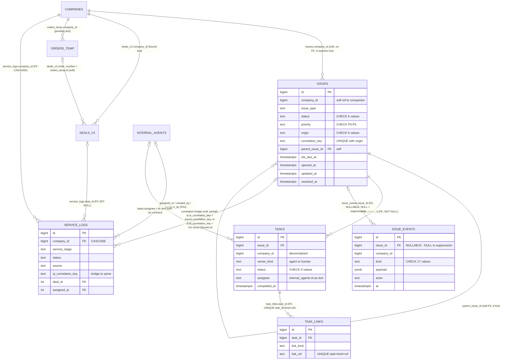

# Service Spine — Agent 2: Database & Data Lineage

**Audit of:** `Tatch-AI/harper-coi-workbench` @ `718064e5dd1d78f02d4d54a3a0a5d8525fac83e4` (2026-08-18 20:09 -0700), read-only checkout at `/tmp/hcw-audit-718064e5`.
**Live DB access:** (a) Supabase MCP `user-supabase` (`execute_sql`, SELECT-only) and (b) Harper Tools MCP `user-harper-tools` (`service_query`, read-only `execute` commands). Both point at the same Harper prod Postgres (the "BigBrother primary").
**Observation window:** 2026-08-19 **17:48–17:56 UTC**. The ledger was live during the window (issues grew 3,855 → 3,856; events 159,886 → 159,914 between consecutive queries), so counts drift by single digits between captures; each count below carries its own capture timestamp.
**No writes were performed.** Every SQL statement was a SELECT; every harper-tools call was a read command; the `ops sql` probe was a read that the gateway itself rejected by allowlist.

---

## 1. Read topology (who reads what, at the pinned commit)

The Service Spine feature has **three read paths**, only two of which the app uses:

1. **Direct pool** (`src/lib/service-spine/db.ts` + `reads.ts`): a `pg` pool on `SERVICE_WRITEBACK_DATABASE_URL`, pinned `default_transaction_read_only = on` per session (fail-closed: a client whose pin fails is destroyed). Three fixed parameterized SELECT folds. This is the production path.
2. **Gateway fallback** (`src/lib/service-spine/gateway-reads.ts`): when the writeback URL is unset, the same reads ride harper-tools `execute` commands — `service issue list` / `service issue get` for spine rows, `ops sql run` for public-schema lookups (company names, cohort sets). The `ops sql` door **cannot** read `service.*`: verified live, the gateway rejects it with `schema "service" is not in the read allowlist (agora, analytics, …, public, …)`.
3. **MCP `service_query`** (harper-tools): a normalized query surface over `service.issues` **merged with** `public.service_logs`, plus curated packs. **The HCW app never calls this**; it exists for MCP clients. Its merge/normalization behavior is documented in §7 because this audit used it for cross-validation.

**UI consumers at the pinned commit:**

| Surface | Endpoint | Store read |
|---|---|---|
| Service spine lane (`ServiceSpineBoard.tsx`, lane id `service-spine`) | `GET /api/action/service-spine[?offset]` | `service.*` only — never `service_logs` |
| Issue slide-over (same component) | `GET /api/action/service-spine?issueId=N` | `service.*` only |
| Account panel "Active issues" (`ActiveSpineIssuesSection.tsx` in `CompanyContextTabs`) | `GET /api/action/service-spine?companyId=N` | `service.*` only |
| Post-bind / Active Service board (separate lane) | `GET /api/active-service/board-extra` | **legacy** `public.service_logs` via `ops sql` |
| Legacy ticket boards (`ServiceTicketBoard` etc., separate lanes) | queue machinery | legacy `public.service_logs` |

Writes from HCW never touch these tables directly: issue close rides harper-tools `service issue resolve` (`issue-write.ts`), task assign/complete ride `service task …` doors (`task-write.ts`), both behind far-side gates (`HARPER_TOOLS_ENABLE_SERVICE_ISSUE_WRITE` default-off, dry-run default-on). The direct pool's credential carries write grants, which is why its read-only session pin is load-bearing.

---

## 2. Entity dictionary

All four spine tables live in schema `service` on the Harper prod Postgres. **None of their DDL ships in the audited repo** (its `migrations/` folders hold unrelated team-actions/placements DDL); the schema is owned by the harper-tools / spine-agent side. Facts below were read live (structure at 17:48 UTC, value distributions per-table timestamps).

### 2.1 `service.issues` — the goal-bearing case (SoT for spine work)

3,855 rows @ 17:48:44Z (3,856 @ 17:49:09Z). RLS **disabled** (see §9). Ownership: written by the spine service agent (event actor `spine-agent-prod`) and harper-tools doors; HCW is read-only + door-mediated closes.

| Column | Type | Null | Default / Constraint |
|---|---|---|---|
| `id` **PK** | bigint identity ALWAYS | no | — |
| `company_id` | bigint | no | **No declared FK** to `public.companies` (soft join; 0 orphans live @ 17:49:09Z) |
| `issue_type` | text | no | Free text, no CHECK. 13 live values (§6) |
| `goal` | text | no | The issue's operator-readable objective |
| `status` | text | no | `'open'`; CHECK ∈ {`open`, `waiting_customer`, `waiting_third_party`, `blocked`, `resolved`, `cancelled`} |
| `blocking` | text | no | `'non_blocking'`; CHECK ∈ {`blocking`, `non_blocking`} |
| `origin` | text | no | CHECK ∈ {`deterministic`, `ai`, `human`, `viper`, `portal`, `financing`} |
| `correlation_key` | text | yes | Natural/external key; 1,449 NULL live; **UNIQUE with origin** (below) |
| `priority` | text | no | `'P3'`; CHECK ∈ {`P0`…`P5`} |
| `sla_due_at` | timestamptz | yes | SLA deadline |
| `parent_issue_id` | bigint | yes | Self-FK → `service.issues.id`; 8 child issues live |
| `ask_ledger` / `promise_ledger` | jsonb | no | `'[]'`; **not read by HCW UI** |
| `latest_summary` | text | yes | Agent's rolling summary |
| `last_communication_summary` | text | yes | Detail panel only |
| `opened_at` | timestamptz | no | `now()` |
| `resolved_at` | timestamptz | yes | Set on terminal transition |
| `resolution_summary` | text | yes | Detail panel only |
| `created_at`, `updated_at` | timestamptz | no | `now()`; `updated_at` is the board's sort key |

Indexes (live `pg_indexes` @ 17:49:09Z):
- `issues_pkey` UNIQUE (`id`)
- `issues_origin_correlation_uq` **UNIQUE (`origin`, `correlation_key`) WHERE correlation_key IS NOT NULL** — the dedupe law: one issue per (origin, key)
- `issues_company_open_idx` (`company_id`) WHERE `status <> ALL ('{resolved,cancelled}')` — serves the account-panel read
- `issues_sla_idx` (`sla_due_at`) WHERE non-null and non-terminal
- `issues_parent_idx` (`parent_issue_id`) WHERE non-null

No soft-delete column anywhere in the spine; terminality is `status ∈ {resolved, cancelled}` (`ISSUE_TERMINAL_STATUSES` in `labels.ts`, mirrored by the partial indexes).

### 2.2 `service.tasks` — the work under an issue

7,617 rows @ 17:48:44Z. Written by the spine agent and harper-tools `service task …` doors.

| Column | Type | Null | Default / Constraint |
|---|---|---|---|
| `id` **PK** | bigint identity ALWAYS | no | — |
| `issue_id` | bigint | no | FK → `service.issues.id` |
| `company_id` | bigint | no | Denormalized copy of the issue's company (0 mismatches live @ 17:49:09Z) |
| `title` | text | no | — |
| `owner_kind` | text | no | CHECK ∈ {`agent`, `human`} |
| `status` | text | no | `'todo'`; CHECK ∈ {`todo`, `in_progress`, `waiting`, `done`, `cancelled`} |
| `assignee` | text | yes | Contract: `internal_agents.id` **as text** (door-resolved). Live @ 17:55:19Z: 101 digit ids, 16 pre-contract display names, 7,502 NULL |
| `lane_skill` | text | yes | e.g. skill ids like `funnel-service-endorsement-change-sop` |
| `gate_label` | text | yes | — |
| `sla_due_at` | timestamptz | yes | — |
| `draft_ref`, `hta_card_ref`, `detail` | jsonb | yes | `detail` carries task-scoped facts (can include customer contact data — PII; not to be re-surfaced casually) |
| `created_at`, `updated_at` | timestamptz | no | `now()` |
| `completed_at` | timestamptz | yes | — |

Indexes: `tasks_pkey`; `tasks_issue_idx` (`issue_id`); `tasks_company_open_idx` (`company_id`) WHERE status not in {done,cancelled}; `tasks_human_open_idx` (`owner_kind`,`status`) WHERE human and open.
"Open task" in every read = `status NOT IN ('done','cancelled')` (`TASK_CLOSED` in code = the partial-index predicate).

### 2.3 `service.task_links` — a task's outward references

422 rows @ 17:48:44Z.

| Column | Type | Null | Notes |
|---|---|---|---|
| `id` **PK** | bigint identity | no | — |
| `task_id` | bigint | no | FK → `service.tasks.id` |
| `company_id` | bigint | no | Denormalized |
| `link_kind` | text | no | Live: `blocked_by_task` 300, `subjectivity_item` 118, `subjectivity_draft` 4 (@ 17:48:44Z) |
| `link_ref` | text | no | Live all-text: 303 digit refs (task ids for `blocked_by_task`), 0 JSON-shaped (@ 17:55:19Z). `reads.ts` still defends against a historical jsonb shape |
| `created_at` | timestamptz | no | `now()` |

Indexes: pkey; **UNIQUE (`task_id`,`link_kind`,`link_ref`)**; (`link_kind`,`link_ref`); (`company_id`).

### 2.4 `service.issue_events` — the append-only timeline

159,886 rows @ 17:48:44Z (159,914 @ 17:49:09Z; fastest-growing table). Append-only by convention (no update timestamps). 32,559 distinct `actor` values @ 17:55:19Z (actors include stable identities like `spine-agent-prod` and higher-cardinality run-scoped identities).

| Column | Type | Null | Notes |
|---|---|---|---|
| `id` **PK** | bigint identity | no | — |
| `issue_id` | bigint | **yes** | FK → `service.issues.id`. **NULL = suppression row**: live, every NULL-issue event is `kind='signal_suppressed'` (33,882 @ 17:49:31Z) and zero `signal_suppressed` rows carry an issue id (@ 17:49:58Z) |
| `company_id` | bigint | no | Suppressions are company-scoped |
| `kind` | text | no | CHECK, 17 values: `opened`, `signal_attached`, `signal_suppressed`, `task_created`, `task_done`, `draft_created`, `dispatched`, `blocked`, `unblock_checked`, `escalated`, `resolved`, `reopened`, `cancelled`, `comment`, `closure_proposed`, `closure_withdrawn`, `auto_closed` |
| `payload` | jsonb | no | `'{}'`; rendered verbatim by the timeline (client splits human story vs technical ids) |
| `actor` | text | no | — |
| `at` | timestamptz | no | `now()`; the timeline's ordering key |

Indexes: pkey; (`issue_id`,`at`); (`company_id`,`at`).

### 2.5 Supporting `public` tables (joined by spine reads)

| Table | Columns used by spine reads | Role |
|---|---|---|
| `public.companies` | `id` bigint PK, `company_name` text | Account name (LEFT JOIN on `issues.company_id`) |
| `public.deals_v2` | `id` int PK, `company_id` bigint, `order_number` bigint (→ `orders_temp.id`, soft), `policy_number` text, `deal_stage` text, `is_deleted` bool | "Bound" test for the Active-services cohort |
| `public.orders_temp` | `id` bigint PK, `company_id` bigint, `is_deleted` bool NOT NULL, `order_complete` bool, `lost_reason` text | "Pending order" test for the Pending-orders cohort |
| `public.internal_agents` | `id` int PK, `first_name`, `last_name`, `email`, `active`, `role` | Assignee id → person directory (read via harper-tools `ops sql`, 30-min cache in `lane-queue-source.ts getIqAgentDirectory`) |

### 2.6 `public.service_logs` — the legacy ticket ledger (BigBrother-owned)

65,899 rows @ 17:49:58Z. **Not read by the spine lane**; read by the Active Service board and legacy ticket boards. Declared FKs (live): `company_id` → `companies(id)` ON DELETE CASCADE; `deal_id` → `deals_v2(id)` SET NULL; `assigned_to`/`created_by`/`resolved_by` → `internal_agents(id)`.

Key columns: `id` bigint PK; `company_id` bigint; `service_stage` text (~58 live values on open rows; full ledger's top: `NO_PENDING_TASKS` 23,270, `IQ_BIND_AND_ISSUE` 3,787, `POLICY_DELIVERY` 3,635, `CANCELLATION_ALERT` 3,399, `GENERAL_SERVICE_REQUEST` 3,358, … @ 17:50Z); `status` text; `priority` text; `source` text NOT NULL; `timestamp` + `task_start_timestamp` timestamptz (age anchor = `COALESCE(task_start_timestamp, timestamp)`); `task_name`, `stage_summary`, `dakota_notes`, `last_communication_summary` text; `assigned_to` int; `deal_id` int; `ai_correlation_key` text; `ai_draft`, `events_associated`, `customer_responses`, `human_override`, `sla_estimates`, `comments` json(b); `resolved_at`, `resolved_by`, `closed_reason`, `time_taken_minutes`.

Live vocabularies @ 17:49:58Z:
- `status`: `done` 54,925; `cancelled` 7,871; `to_do` 1,934; `assigned` 777; `in_progress` 195; `blocked` 188; `completed` 9. ("Open" in every reader = `to_do|in_progress|assigned|blocked`.)
- `source`: `ai` 36,516; `deterministic` 22,155; `human` 5,374; `service_portal` 1,854.
- `priority` (mixed vocabulary + a data-quality quirk): the **literal string `'NULL'`** on 35,245 rows, `P1` 10,811, `P0` 7,176, `medium` 3,588, `P2` 2,828, `critical` 2,651, `low` 2,283, `high` 1,316, true NULL 1.

---

## 3. Join graph



**Cardinality & keys** (live @ 17:49:09Z unless noted):

| Question | Answer |
|---|---|
| Can one company have multiple issues? | **Yes.** 2,608 distinct companies over 3,856 issues; 765 companies hold >1 issue; **517 hold >1 open issue**; max 12 issues on one company. |
| Can one issue span multiple orders? | **No first-class order relation exists.** An issue binds to a company, not an order/deal. Order/deal identity rides only (a) `correlation_key` text (e.g. `deterministic:iq_coi_send:order:{id}`, `deterministic:policy_delivery:deal:{id}` — at most one ref per key) and (b) task `detail` JSON. Cross-order work on one account lands as one-issue-per-key by the unique index, or as sibling issues on the same company. |
| Tasks per issue | 0..n (sample max seen: 14). `tasks.company_id` never disagrees with the parent issue (0 mismatches). |
| Events per issue | 0..n (avg ≈ 41; sampled issue carried 124). Suppression events have **no** issue (33,882 rows, all `signal_suppressed`). |
| Orphan risk | `issues.company_id` has **no declared FK** — orphaning is possible by schema, zero observed. All other spine relations are declared FKs. Legacy `service_logs.company_id` cascades on company delete. |
| Soft delete | None in the spine. Terminality is status-based (`resolved`/`cancelled` for issues; `done`/`cancelled` for tasks). Legacy cohort predicates honor `is_deleted` on `deals_v2`/`orders_temp`. |
| Stable key for URLs / React keys | `service.issues.id` (bigint identity, never reused). The board keys rows by `id`; the pager dedupes pages by `id` (`foldPages`). harper-tools mints `issue_ref = SVC-{company_id}-{id}` and `LEGACY-{service_logs.id}` — display refs, not DB columns. |
| Dedup rule at mint | UNIQUE (`origin`, `correlation_key`) WHERE key non-null. 1,449 issues (38%) carry no key and are dedupe-exempt. Live: 0 duplicate keys even ignoring origin. |

---

## 4. Read-query catalog (endpoint → SQL → tables → response shape)

### 4.1 `GET /api/action/service-spine` (board list; `route.ts` → `readServiceSpineBoard`)

Auth: `requireUser()`. Params: `offset` (int ≥ 0, default 0; page size fixed at `SPINE_ISSUE_PAGE = 500`). An offset ≥ the whole-table count short-circuits to zero rows ("offset wall").

Queries (direct pool, all parameterized; `$1 = TASK_CLOSED = ['done','cancelled']`):

1. **Status summary** (every page; also the paging denominator):
   `SELECT status, count(*)::int AS n FROM service.issues GROUP BY status`
2. **Task tallies** (first page only): `SELECT owner_kind, status, count(*)::int FROM service.tasks GROUP BY owner_kind, status`
3. **Event totals** (first page only): `SELECT count(*)::int AS total, count(*) FILTER (WHERE issue_id IS NULL)::int AS suppressions FROM service.issue_events`
4. **Issue page** (`ISSUES_SQL`): one statement, no N+1 —

```330:374:/tmp/hcw-audit-718064e5/src/lib/service-spine/reads.ts
const ISSUES_SELECT = `
  SELECT i.id, i.company_id, c.company_name,
         i.issue_type, i.goal, i.status, i.priority, i.blocking, i.origin,
         i.correlation_key, i.sla_due_at, i.latest_summary,
         i.opened_at, i.updated_at, i.resolved_at,
         COALESCE(t.agent_total, 0)::int AS agent_total,
         // ... LATERAL task tallies + open human assignees ...
  FROM service.issues i
  LEFT JOIN public.companies c ON c.id = i.company_id
  LEFT JOIN LATERAL ( ... FROM service.tasks WHERE issue_id = i.id ) t ON true
  LEFT JOIN LATERAL ( ... FROM service.issue_events WHERE issue_id = i.id ) e ON true`;

const ISSUES_SQL = `${ISSUES_SELECT}
  ORDER BY i.updated_at DESC, i.id DESC
  LIMIT $2 OFFSET $3`;
```

   - Task LATERAL: `count(*) FILTER (WHERE owner_kind='agent')`, same filtered by `status <> ALL($1)` for open; ditto `human`; plus `array_agg(DISTINCT nullif(btrim(assignee),'')) FILTER (WHERE owner_kind='human' AND status <> ALL($1) AND assignee non-empty)` as `open_human_assignees`.
   - Event LATERAL: `bool_or(kind='draft_created')`, `bool_or(kind='closure_proposed')`, `count(*)`, `max(at)`.
   - Plus the **account-stage CASE** (`accountStagePendingOrderSql`): `NULL` if no company; `FALSE` (= Active services) if `EXISTS deals_v2 d WHERE d.company_id=i.company_id AND (not deleted) AND TRIM(policy_number) <> ''` (the one shared bound predicate, deliberately with **no deal-stage exclusion**); else `TRUE` (= Pending orders) if `EXISTS orders_temp o` alive/incomplete/not-lost AND (no live deal on the order OR a live deal with empty policy_number whose stage ∉ {lost,dead,cancelled,denied}); else `NULL` (= "Others", untagged).
5. **Assignee directory** (parallel, via harper-tools `ops sql`, 30-min cache): `SELECT ia.id::text, first_name, last_name, email FROM public.internal_agents ia`.

Response: `{ ok, summary | null, issues: ServiceSpineIssueRow[], paging: {offset, limit, served, counted, hasMore, note} }`. `counted` = sum of the status GROUP BY (whole ledger), `hasMore = offset + served < counted`; the client auto-walks up to 4 pages of 500 then leaves a Load-more. Failures return `{ ok:false, reason, transient }` — named, never an empty board.

### 4.2 `GET /api/action/service-spine?companyId=N` (account panel)

`COMPANY_ISSUES_SQL` = same `ISSUES_SELECT` + `WHERE i.company_id = $2 AND i.status <> ALL($3)` (`$3 = ISSUE_TERMINAL_STATUSES = ['resolved','cancelled']`), `ORDER BY i.updated_at DESC LIMIT 50`. Served by `issues_company_open_idx`. Response `{ ok, companyId, issues, capped }`.

### 4.3 `GET /api/action/service-spine?issueId=N` (detail slide-over)

Four parallel queries + directory:
- Head: `SELECT i.*, c.company_name, {account-stage CASE} AS pending_order FROM service.issues i LEFT JOIN public.companies c ON c.id=i.company_id WHERE i.id=$1` (`i.*` is why the detail also carries `last_communication_summary`, `resolution_summary`).
- Timeline (`EVENTS_SQL`): `SELECT id, kind, payload, actor, at, count(*) OVER () AS total_events, bool_or(kind='draft_created') OVER (), bool_or(kind='closure_proposed') OVER () FROM service.issue_events WHERE issue_id=$1 ORDER BY at DESC, id DESC LIMIT 500` — window aggregates run before the LIMIT so a capped page still reports the true count; client re-sorts oldest-first and sets `eventsTruncated = total > served`.
- Tasks: `SELECT id, title, owner_kind, status, assignee, lane_skill, gate_label, sla_due_at, created_at, completed_at FROM service.tasks WHERE issue_id=$1 ORDER BY created_at ASC`.
- Links: `SELECT tl.id, tl.task_id, tl.link_kind, tl.link_ref, tl.created_at, t.title AS task_title FROM service.task_links tl JOIN service.tasks t ON t.id=tl.task_id WHERE t.issue_id=$1 ORDER BY tl.created_at ASC`.

Detail-level aggregates (task counts, event count, hasDraft, closureProposed) are re-derived from the detail's own rows so the panel can't disagree with itself.

### 4.4 Gateway fallback (same three reads, no direct pool)

- Board: `service issue list --open false --limit 200` (door clamps at 200; **no offset** — one page only, saturation is said on-screen), then per-issue `service issue get --issue-id N --include-tasks true --include-events false` at concurrency 16 for task tallies; company names / pending cohort / bound cohort via `ops sql run` over `public.companies` / `orders_temp` / `deals_v2` in id-chunks of 80 (same shared predicates). Suppressions are reported as 0 (the door has no suppression count).
- Company issues: `service issue list --company-id N --open true --limit 50` + client-side terminal-status guard.
- Detail: `service issue get --issue-id N --include-tasks true --include-events true --events-limit 100`; task links are **not** served on this path (honest empty).
- Verified live (~17:54Z): `service issue list` returns raw `service.issues` rows (all columns, snake_case, plus `issue_ref = SVC-{company_id}-{id}`); `--open true` includes `blocked`/waiting rows (open = non-terminal, matching the app's law).

### 4.5 `GET /api/active-service/board-extra` (legacy lane — the contrast case)

All via harper-tools `ops sql run --limit 1000` (public schema only):
- `openRoutingTicketsPageSql(afterId)`: keyset pages (`sl.id > afterId`, `ORDER BY sl.id ASC`, ≤ 40 pages) over `public.service_logs sl LEFT JOIN deals_v2 d ON d.id=sl.deal_id LEFT JOIN internal_agents iag ON iag.id=sl.assigned_to LEFT JOIN companies c ON c.id=sl.company_id WHERE sl.status IN ('to_do','in_progress','assigned','blocked') AND sl.service_stage IS NOT NULL AND UPPER(BTRIM(sl.service_stage)) NOT IN ('NO_PENDING_TASKS','COI_TAKEOVER_AUDIT')`. Age anchor `COALESCE(task_start_timestamp, timestamp)`.
- `boundCompaniesSql` / `unboundOrderCompaniesSql` over id CSV chunks of 900 (same shared bound predicate; unbound = alive, incomplete, not-lost order).
- The BigBrother lane router (`primaryLaneForCompanyTickets`) + post-sales and subjectivity peels then run **in process**; membership rows become account cards.

---

## 5. Field lineage (UI field → table.column → transformation)

Spine board row / card / detail (`SpineIssueRowView`):

| UI field | Source | Transformation |
|---|---|---|
| Issue id (`#123`, React key, detail URL param) | `service.issues.id` | int passthrough |
| Company name (account door) | `public.companies.company_name` via LEFT JOIN on `issues.company_id` | null-safe; gateway path resolves via `ops sql` name lookup |
| Company id | `service.issues.company_id` | int or null |
| Status pill / kanban column | `service.issues.status` | Label via `STATUS_LABELS` (stored value never rewritten; unknown → underscores-to-spaces). Column = `spineColumnOf`: terminal → `closed`; else `closure_proposed` event signal overrides; else status verbatim (unknown status becomes its own appended column) |
| Priority tag | `service.issues.priority` | verbatim; P0 red / P1 amber styling |
| Issue type | `service.issues.issue_type` | verbatim; label = underscores → spaces |
| "blocking" pill | `service.issues.blocking` | shown only when `= 'blocking'` |
| Origin (meta row; no badge on this board) | `service.issues.origin` | verbatim in the "ids & metadata" disclosure. (The legacy ticket boards' Source/IQ/Broker-style badges read `service_logs.source` (`rowSource`) and `events_associated->'ai_trigger'->>'source'` — legacy lineage, not spine.) |
| Goal / description | `service.issues.goal` | verbatim (3-line clamp on cards) |
| Latest summary / Last communication / Resolution | `issues.latest_summary` / `.last_communication_summary` / `.resolution_summary` | verbatim; the latter two detail-only (`SELECT i.*`) |
| SLA chip (countdown, amber < 4h, red breached) | `service.issues.sla_due_at` | client-side live countdown; hidden on terminal statuses |
| Wave filter/chip | **derived from** `service.issues.correlation_key` | prefix before `:` matched on `/(\d{4})(\d{2})(\d{2})$/` → `MMDD` (e.g. `spine-prod-20260730:…` → wave `0730`). No dedicated column |
| Account-stage tag (Pending orders / Active services / untagged Others) | `public.deals_v2` + `public.orders_temp` via the CASE in §4.1 | `true`→Pending, `false`→Active (bound wins), `NULL`→no tag. Bound = non-deleted deal with non-empty `policy_number`, **no stage exclusion** |
| Agent tasks `open/total` | `service.tasks` LATERAL | `count FILTER owner_kind='agent'` [± `status <> ALL('{done,cancelled}')`] |
| Human tasks `open/total` | `service.tasks` LATERAL | same, `owner_kind='human'` |
| Queue picker people / My queue match | `service.tasks.assignee` on open human tasks | distinct non-empty; digit ids resolved to name + email through `public.internal_agents` (directory via harper-tools; unresolved ids pass through raw) |
| Draft flag (pen icon) | `service.issue_events.kind='draft_created'` | `bool_or` per issue |
| Closure-proposed column/state | `service.issue_events.kind='closure_proposed'` | `bool_or`; outranks raw status in column fold |
| Event count + last activity | `service.issue_events` | `count(*)`, `max(at)` per issue |
| Suppressed events (board header) | `service.issue_events WHERE issue_id IS NULL` | count; live these are exactly `signal_suppressed` |
| Timeline entries | `issue_events.id/kind/payload/actor/at` | payload verbatim, client splits human text vs technical ids (UUID/opaque-token/`*_id` keys fold behind a disclosure); order restored oldest-first |
| Task rows (detail Tasks tab) | `service.tasks` columns incl. `lane_skill`, `gate_label`, `sla_due_at`, `completed_at` | assignee id → display name via directory |
| Connections tab | `service.task_links.link_kind/link_ref` + owning task title | `link_ref` flattened to string if ever non-text |
| Opened / Updated / Closed timestamps | `issues.opened_at` / `.updated_at` / `.resolved_at` | ISO-normalized (`asIso`) |
| Order/deal/policy references | **no first-class spine column** | visible only inside `correlation_key` text (e.g. `…:order:13265`, `…:deal:4682`), event payloads, and task `detail` JSON. Legacy rows carry a real `deal_id` → `deals_v2.policy_number` |
| Board summary counts (issues by status, task tallies, event totals) | whole-table GROUP BYs (§4.1 q1–q3) | first page only; continuations reuse page one's copy |

Account-panel "Active issues" rows reuse the same row shape (subset: id, issueType, goal, status, priority, agentOpen, humanOpen) — one label fold (`labels.ts`) for both faces.

---

## 6. Live-data verification (both tools, with timestamps)

### 6.1 Via `user-supabase` `execute_sql` — 2026-08-19 **17:48:44 UTC**

`service.issues.status` (n=3,855): `open` 2,309 · `resolved` 718 · `blocked` 329 · `waiting_customer` 243 · `waiting_third_party` 173 · `cancelled` 83. Open (non-terminal) = 3,054 (3,055 @ 17:52:21Z).
`service.issues.priority`: `P2` 1,263 · `P1` 1,255 · `P0` 917 · `P3` 359 · `P4` 51 · `P5` 10.
`service.issues.origin`: `ai` 2,860 · `deterministic` 738 · `portal` 223 · `human` 34 · (`viper`, `financing` allowed by CHECK, **zero rows live**; no NULLs).
`service.issues.blocking`: `non_blocking` 3,169 · `blocking` 686.
`service.issues.issue_type` (@ 17:48:45Z, 13 values): `general_request` 759 · `cancellation` 741 · `policy_delivery` 500 · `endorsement` 486 · `onboarding` 474 · `coi_request` 359 · `payment_failure` 246 · `subjectivity` 156 · `inspection` 62 · `portal_access` 42 · `pfa` 16 · `claim` 13 · `refund` 1.
`service.tasks.status` (n=7,617): `todo` 3,767 · `done` 2,271 · `waiting` 986 · `cancelled` 506 · `in_progress` 87 → open = 4,840. `owner_kind`: `agent` 4,296 · `human` 3,321.
`service.issue_events.kind` (n≈159,903): `comment` 95,028 · `signal_suppressed` 33,877 · `task_created` 7,556 · `signal_attached` 4,706 · `opened` 3,826 · `draft_created` 2,976 · `escalated` 2,844 · `task_done` 2,262 · `unblock_checked` 1,998 · `closure_proposed` 1,898 · `dispatched` 1,627 · `blocked` 463 · `auto_closed` 401 · `resolved` 312 · `cancelled` 83 · `closure_withdrawn` 46.
`service.task_links.link_kind` (n=422): `blocked_by_task` 300 · `subjectivity_item` 118 · `subjectivity_draft` 4.
Correlation-key prefix families (@ 17:49:4xZ, top): `spine-prod-20260730` 872 · `deterministic` 737 · `portal` 224 · `spine-live-20260731` 150 · `spine-prod-20260731` 90 · `docusign` 83 · `ai` 60 · `spine-subj-lifecycle-20260731` 46 · `sms` 35 · `ops` 28 · long tail of remediation-cycle keys.

### 6.2 Via `user-harper-tools` `service_query` — ~**17:50–17:52 UTC**

- `list_issues` (limit 200, ~17:50:45Z): 200 rows, `by_store: {spine: 61, legacy: 139}`, newest-first. Spine rows carried statuses `open`/`blocked`, priorities `P0`/`P1`, origins `ai`/`deterministic` — all within the CHECK sets above. Legacy rows carried `to_do` statuses, raw priorities incl. `critical` and `unknown` (the tool's face for the legacy `'NULL'`-string priority), stage = `service_stage` verbatim.
- `get_timeline` issue 120 (~17:51:05Z): pack `service.issue_timeline.v1`, `row_count: 124`. **SQL at 17:51:27Z: 124 events. Exact match.** Event rows are enriched with joined issue fields (`company_name`, `issue_type`, `issue_status`, `priority`) the raw table does not hold.
- `list_tasks` issue 120 (~17:51:10Z): `count: 4` — the door's default excludes terminal tasks. **SQL: 14 total, 4 open. Match once the default is known.** The door also derives `blocked_by_task_id`/`blocked_by_status`/`blocked`/`actionable` from `task_links` (`blocked_by_task`) — pure normalization, no extra column.
- `run_pack open_issues_by_stage` (`service.open_issues_by_stage.v1`, ~17:52Z): 238 grouped rows by (source_store, stage, issue_type, priority). **Spine open total = 3,055 = SQL spine open at 17:52:21Z. Exact match.** Legacy open total = 2,360 vs raw SQL 3,089 — see discrepancy D3.
- The pack's spine `stage` is **derived** (values like `G1`…`G6`, `awaiting_signature`, `awaiting_binder`, `sent_to_underwriter`, `countersigned`, plus type-echoes) — no such column exists on `service.issues`; the derivation lives server-side in harper-tools.

---

## 7. Legacy `public.service_logs` ↔ `service.issues`

- **Which does the UI read at the pinned commit?** The Service spine lane, its detail panel, and the account panel's Active issues read **only `service.issues` / `service.tasks` / `service.task_links` / `service.issue_events`** (comments in `route.ts` and `ActiveSpineIssuesSection` pin it: "never the legacy service_logs ticket board"). Legacy `service_logs` remains the substrate of the *other* lanes (Active Service membership board, ticket boards, queue) and of BigBrother parity.
- **Bridge, spine → legacy:** legacy tickets are minted as *projections* of spine issues with `ai_correlation_key = 'svc:issue:{issues.id}'` — 566 open legacy rows carried such keys @ 17:52:43Z. (`issue-write.ts`: "SoT is service.issues …, never service_logs as truth (projection rides the door)".)
- **Bridge, shared-key:** 26,787 of 65,899 legacy rows carry `ai_correlation_key`; 1,460 of them exactly equal a `service.issues.correlation_key` (@ 17:49:58Z) — e.g. one DocuSign envelope key was observed live on both a legacy ticket and a spine issue simultaneously.
- **Bridge cardinality:** one spine issue ↔ up to many legacy rows. `ai_correlation_key` is not unique on `service_logs` (697 duplicated keys, max 6 rows per key @ 18:01:18Z), while `(origin, correlation_key)` is unique on `service.issues`.
- **No FK exists between the two ledgers**; the bridge is text-key convention, partial by design, and only the harper-tools `service_query`/pack layer merges them.

---

## 8. Cross-tool discrepancies (explicit, with numbers)

| # | Observation | Explanation / status |
|---|---|---|
| D1 | `list_tasks` served 4 rows where SQL held 14 (issue 120) | **Explained**: the door's `include_closed` defaults to false; SQL open-task count is exactly 4. Not a data mismatch. |
| D2 | `list_issues` served the **same work item twice** — a legacy row (`LEGACY-128245`) and a spine row (`SVC-928074-3894`) sharing one correlation key, adjacent in one page (~17:50:45Z) | **Real behavior of the merge surface**: `list_issues` does not dedupe across stores. Any consumer counting "open work" from `list_issues` double-counts mirrored items. The HCW app is unaffected (it never calls `service_query`). Flagged for the harper-tools owners. |
| D3 | Pack `open_issues_by_stage` legacy open total **2,360** vs raw SQL open legacy **3,089** (Δ729, same minute) | **Partially explained, exact rule not recoverable from this repo.** The pack clearly suppresses legacy rows the spine already represents: my closest reproduction ("open legacy whose `ai_correlation_key` resolves to an *open* spine issue, via `svc:issue:{id}` pointer or exact key match") leaves 2,243 and matches some stages almost exactly (CANCELLATION_ALERT 475 vs pack 477) but misses others badly (FINAL_PAYMENT_PENDING 177 vs pack 49; company+type dedup also fails: 14). The pack SQL lives server-side in harper-tools (`service.open_issues_by_stage.v1`), outside the pinned repo. **Open question Q1.** |
| D4 | Pack/`list_issues` spine `stage` values (`G1`…`G6`, `awaiting_signature`, …) exist in no spine column | **Explained as derivation**: harper-tools computes a stage/gate from issue state server-side ("derived spine stage/gate" per the tool schema). Source of that fold is not in this repo. |
| D5 | Legacy `priority` shows `unknown` through the tool but `'NULL'` (a literal string, 35,245 rows) in SQL | **Explained as normalization** + a genuine data-quality quirk in `service_logs.priority` (mixed vocab: P0–P2 / critical / high / medium / low / literal `'NULL'` / one true NULL). |
| D6 | Suppression counts: direct pool reports `events.suppressions` (33,88x live); gateway board path reports 0 | **Explained**: code-level limitation of the fallback (`summaryFromIssueRows` hard-codes `suppressions: 0`) — the gateway door exposes no suppression count. On gateway deploys the board's suppression figure under-reports. |
| — | Counts that matched exactly across tools | Spine open 3,055 = 3,055 (17:52Z); issue-120 events 124 = 124; issue-120 open tasks 4 = 4; all enum values served by the tool ⊂ live CHECK constraints. |

---

## 9. Security / integrity notes

- **RLS is disabled on all four spine tables** (`service.issues`, `service.tasks`, `service.task_links`, `service.issue_events`) — Supabase security advisor, severity *critical*: the tables are exposed to the anon/authenticated Supabase client roles. Remediation (do **not** auto-apply — enabling RLS without policies blocks all access, and the spine agent + harper-tools service roles must be policied first): see [Supabase RLS guide](https://supabase.com/docs/guides/database/postgres/row-level-security).

```sql
ALTER TABLE service.issues       ENABLE ROW LEVEL SECURITY;
ALTER TABLE service.tasks        ENABLE ROW LEVEL SECURITY;
ALTER TABLE service.task_links   ENABLE ROW LEVEL SECURITY;
ALTER TABLE service.issue_events ENABLE ROW LEVEL SECURITY;
```

- The HCW direct pool's credential carries **write grants** (it is the writeback credential); the app compensates with a fail-closed session-level `default_transaction_read_only` pin (`db.ts`). A read-scoped role would be the structural fix (the code itself says so).
- `service.tasks.detail` and event payloads carry customer contact PII (names, phones, addresses); any downstream consumer (including Step Bro) should treat those JSON bags as sensitive, not as render-verbatim metadata.
- Offset pagination over `ORDER BY updated_at DESC` can skip/repeat rows mid-walk; the board compensates with served-vs-counted + id-level dedupe (`foldPages`), and the code names keyset paging on `(updated_at, id)` as the upgrade path.

## 10. Open questions (no guesses)

1. **Q1 (D3):** Exact legacy-suppression rule inside pack `service.open_issues_by_stage.v1` (and whether `list_issues` *should* dedupe mirrored items, per D2). Needs the harper-tools server source or its owner.
2. **Q2 (D4):** Derivation table for the spine `stage`/gate (`G1`…`G6`, `awaiting_signature`, …) served by `service_query` — where is it computed and from which columns/events?
3. **Q3:** `issues.company_id` has no declared FK — is that deliberate (cross-database mint ordering?) or an omission to fix alongside RLS?
4. **Q4:** `origin` values `viper` and `financing` are constraint-legal but have zero live rows — planned producers or dead vocabulary?
5. **Q5:** `ask_ledger` / `promise_ledger` jsonb are written by the agent but read by no HCW surface — who consumes them (Step Bro candidate?)?
6. **Q6:** 16 `service.tasks.assignee` values are pre-contract display names (not `internal_agents` ids). Backfill or leave to the directory-membership fallback?
