# Service Spine — Agent 3: Mutations, Workflows, Permissions, Audit

Audit of `Tatch-AI/harper-coi-workbench` @ `718064e5dd1d78f02d4d54a3a0a5d8525fac83e4` (read-only checkout at `/tmp/hcw-audit-718064e5`). Method: code inspection of every route/lib/component in scope, the pinned tests, `config/env-manifest.json`, plus **read-only** observation of live record shapes via `user-harper-tools service_query` (list_issues / get_timeline / list_tasks) and `user-supabase execute_sql` (SELECT-only against `service.*` and `pg_constraint`). Zero writes were performed anywhere; no mutation API was triggered.

All `file:symbol` references are paths inside the source repo at the pinned commit.

---

## 1. Architecture: three planes, one write door

The Service Spine surface in HTA (the source app) is split into three planes with different credentials:

| Plane | Store | Credential (env var names only) | Access |
|---|---|---|---|
| **Spine truth** | `service.issues`, `service.tasks`, `service.task_links`, `service.issue_events` on the BigBrother primary Postgres | `SERVICE_WRITEBACK_DATABASE_URL` (read leg only) | READ-ONLY pool. Every session runs `SET default_transaction_read_only = on`, fail-closed: a client whose pin fails is destroyed, never handed to a caller — `src/lib/service-spine/db.ts:getReadOnlyClient`. Only fixed parameterized SELECTs pass through `serviceSpineQuery`. |
| **Spine writes** | Same tables, but **never via SQL from this app** | `HARPER_TOOLS_MCP_URL` (or `HARPER_TOOLS_BASE_URL` + `/mcp`) + `HARPER_TOOLS_API_KEY` | All mutations go through the harper-tools MCP gateway (`tools/call` → `execute` with a virtual-CLI command) — `src/lib/harper-mcp.ts:callExecute`. Server-side secret; never sent to the browser. |
| **Audit + feedback** | `team_actions.action_log`, `team_actions.feedback_log` on the Harper Ops Supabase | `DATABASE_URL` (falls back to gitignored local JSON under `.coi-data/` when unset) | Direct parameterized INSERT/DELETE — `src/lib/action-log.ts:writeAction`, `src/lib/feedback/store.ts:saveFeedback` |

Key consequence: **this repo contains no SQL INSERT/UPDATE against `service.*` at all.** The main lane route `src/app/api/action/service-spine/route.ts` is GET-only ("GET is the route's only verb", line 23). Writes exist only as harper-tools commands, and the far side carries its own enable gates (`HARPER_TOOLS_ENABLE_SERVICE_ISSUE_WRITE` default-off, `HARPER_TOOLS_SERVICE_ISSUE_WRITE_DRY_RUN` default-on — named in `src/lib/service-spine/task-write.ts:spineTaskWriteWiringDiagnostic` and `issue-write.ts:spineIssueCloseWiringDiagnostic`; env var names live in the server-side diagnostic only, never in the response body, pinned by `tests/service-spine-issue-close-route-pin.test.ts` "the gate id is server copy").

---

## 2. Complete mutation inventory (everything reachable from the Service Spine UI)

UI render sites (the whole write surface):

- `src/components/actions/ServiceSpineBoard.tsx` detail panel renders `SpineIssueCloseActions` (line ~888), `SpineTaskActions` per task row with `control="assign"` (Assignee column, only when `isOpenHumanTask`) and `control="complete"` (Actions column), and `SpineIssueFeedback` (issue-level block + per-task inline).
- `src/components/actions/ActiveSpineIssuesSection.tsx` (account panel "Active issues") renders **only** `SpineIssueFeedback` (inline thumbs). No close/assign/complete from the account panel.
- Board header links to `/feedback?lane=service-spine&locked=1` (a read view; `spine-issue-feedback.ts:spineFeedbackViewerHref`).

That yields exactly **six mutations**. There is **no** un-complete, no due-date/SLA edit, no reopen, no waiting/blocked toggle, no combine-waiting, no issue creation, no manual timeline-event creation anywhere in the spine UI (grep of `src/lib/service-spine/` for reopen/uncomplete/due-date/snooze/combine: zero hits; `service_query` and the board expose these fields read-only). "My queue" / queue-picker filtering is pure client state, nothing persists (`src/lib/service-spine/my-queue.ts` — pure functions only).

### 2.1 Mutation contract table

| # | Action | Route + method | Auth | Validation (all manual, no zod on these routes) | Far command / SQL executed | Audit rows | Idempotency / concurrency | Error / response contract |
|---|---|---|---|---|---|---|---|---|
| 1 | **Assign human task** | `POST /api/action/service-spine/task` `{action:"assign", taskId, assignee, note?}` — fired by `SpineTaskActions.tsx:assign` | `requireUser()` (Clerk; see §5). `isPublicPreview()` → 403 refused, zero door calls (`task/route.ts:85`) | `action ∈ {assign,complete}` (route:104); `taskId` positive integer (route:108); `assignee` non-empty trimmed string (route:135); `note` optional string. Second wall in lib: empty assignee → refused `invalid_input` without a door call (`task-write.ts:258`) | harper-tools `service task assign` with `{task_id, assignee, confirm:true, source_skill:"harper-team-actions/service-spine-task", note?≤4000, actor?≤200}` (`task-write.ts:assignSpineTaskViaHarperTools`). Far side resolves assignee to an `internal_agents` id and persists it on `service.tasks.assignee`; refuses ambiguous names (route:47-55 comments). **Observed far-side event**: kind `comment`, payload `{assign:true, task_id, to_assignee:"<id>", assignee_via:"assignee_id", assignee_name, from_assignee}`, actor = operator email | `team_actions.action_log` row: `itemId spine-task:<id>`, `lane service-spine`, `channel service_spine_task`, `actor user.email ?? user.name`, `fired = result.ok`, `dryRun = !ok`, meta `{action, status, farStatus, blockedBy, issueId, diagnostic}` (`task/route.ts:144-171`); best-effort, `.catch` → console.warn only. Plus the far side's own `service.issue_events` row + `ledger_row_id` | **No idempotency key, no version check in HTA.** Far side can answer `conflict` → mapped to refused 409 "This task changed while the panel was open. Re-read it" (`task-write.ts:142`). Mutating calls never retry (`harper-mcp.ts:253-267`: "Mutating callers must never opt in"). `unknownOutcome:true` on wire throw / `send_failed` / unrecognized status → the client **locks the control** for the panel's life instead of re-arming a double-fire (`SpineTaskActions.tsx:67-71,149-157`) | Statuses `applied\|held\|refused\|failed\|not_configured` mapped to HTTP 200/200/409/502/503 (`task/route.ts:177-184`). Body `{ok, status, farStatus, note (operator copy only), unknownOutcome, taskId, issueId}`; `blockedBy` (gate id) deliberately kept off the wire (route:186-188). Only far `assigned` is applied (`task-write.ts:101`) |
| 2 | **Complete human task** | Same route, `{action:"complete", taskId, note?}` — `SpineTaskActions.tsx:complete` (two-tap confirm in UI) | Same as #1 | Same as #1 minus assignee | harper-tools `service task transition` with `{task_id, status:"done", confirm:true, source_skill, note?, actor?}` (`task-write.ts:completeSpineTaskViaHarperTools`). "done" is the **only** status this app ever sends. **Observed far-side event**: kind `task_done`, payload `{task_id, to_status:"done", transition:true, from_status:"todo"}`, actor = operator email | Same `service_spine_task` channel row | Same as #1; only far `transitioned` is applied | Same as #1. Pinned: `tests/service-spine-task-write.test.ts` "calls service task transition status=done with confirm=true" |
| 3 | **Resolve issue** | `POST /api/action/service-spine/issue` `{action:"resolve", issueId, summary}` — `SpineIssueCloseActions.tsx:fire` (draft + required summary + confirm) | Same pattern (`issue/route.ts:38-49`); preview → 403 with zero door calls (pinned: `service-spine-issue-close-route-pin.test.ts:160`) | `action ∈ {resolve,cancel}` (route:59); `issueId` positive int (route:64); `summary` trimmed ≥ 3 chars (route:70), capped at 4000 in lib (`issue-write.ts:243`); second wall in lib (`issue-write.ts:231`) | harper-tools `service issue resolve` with `{issue_id, action:"resolve", summary, confirm:true, source_skill:"harper-team-actions/service-spine-issue", actor?}` (`issue-write.ts:closeSpineIssueViaHarperTools`). Only far status `closed` is applied (`issue-write.ts:97`). **Observed far-side event**: kind `resolved`, payload `{body:<summary>, action:"resolve", from_status:"open", to_status:"resolved"}`, actor = operator email; `service.issues.resolved_at` + `resolution_summary` populated on observed resolved rows | `action_log` row: `itemId spine-issue:<id>`, `channel service_spine_issue`, meta `{action, status, farStatus, blockedBy, issueStatus, diagnostic}` (`issue/route.ts:95-118`), best-effort | Same grammar as tasks: no idempotency key; far `conflict` → 409 "issue changed while the panel was open"; `HarperToolsCommandError` and pre-dispatch `HarperToolsRejectedError` are **proven no-writes** → 409 refused without unknownOutcome; transport throw → 502 `unknownOutcome:true` → UI locks Resolve/Cancel (`SpineIssueCloseActions.tsx:33,76`; pinned by `tests/service-spine-issue-close-lock-pin.test.tsx`) | Same HTTP map (issue/route.ts:124-131). Body adds `issueStatus` (far echo, else `"resolved"\|"cancelled"`). Full mapping pinned in `tests/service-spine-issue-close-route-pin.test.ts` |
| 4 | **Cancel issue** | Same route, `{action:"cancel", issueId, summary}` | Same | Same | Same command with `action:"cancel"`; far event kind `cancelled` (83 rows observed; same payload family) | Same | Same | Same |
| 5 | **Submit feedback thumb (issue- or task-scoped)** | `POST /api/action/feedback` — `SpineIssueFeedback.tsx:submit` → `postFeedback` → body built by `spine-issue-feedback.ts:buildSpineIssueFeedbackBody` | Three doors (`feedback/route.ts:144-168`): signed-in Clerk user (source `card`, actor = email ?? name), **or** bearer `INGEST_TOKEN` (source `api`, actor `feedback-token`; `src/lib/ingest/ingest.ts:checkTokenAuth`, sha-256 + `timingSafeEqual`), **or** DEC-27 trusted-correction identity (headers + per-identity bearer, §5). **No `isPublicPreview()` gate on this route** — a public-preview deploy accepts thumbs under the synthetic `preview@harperinsure.com` identity | Body is `FeedbackBody`; engine requires `observation` non-empty (`feedback.ts:179`) and a known `verdict` (`feedback.ts:184`). Spine thumbs: `verdict:"other"` always (`spine-issue-feedback.ts:spineThumbVerdict`), `itemId spine:issue:<id>`, `stepId spine:task:<id>?`, `lane service-spine`, `area spine-issue\|spine-task`, evidence `[{kind:spine_issue},{kind:spine_thumb,ref:up\|down},{kind:spine_task}?]`; thumbs-down requires a comment (client-enforced + `buildSpineIssueFeedbackBody` throws on blank down-observation). `clientRef` without trusted capability → 403 (route:171) | `INSERT INTO team_actions.feedback_log (...21 cols...) ON CONFLICT (client_ref) WHERE client_ref IS NOT NULL DO NOTHING RETURNING *` (`store.ts:saveFeedback:50-57`). Spine `itemId` regex skips the ServiceItem resolve (`feedback.ts:195-198`). Thumbs-up on a spine item auto-stamps receipt signal-class evidence (`feedback.ts:233-241`). Verdict `other` → ledger effect **none**: no playbook-override stamp ever (pinned: `tests/spine-issue-feedback-payload-pin.test.ts` "no ledger stamp") | The feedback_log row **is** the record. Side effects, all fail-soft/fire-and-forget: `mirrorEntryToPlane` + `emitSelfHealTriggerCandidate` (route:231-238, both swallow errors) | Card thumbs carry **no clientRef → no dedup**: every submit inserts a new row. Trusted-correction writes are idempotent on `client_ref` (`operator-feedback:<n>` pattern, `feedback.ts:trustedClientRef`); replay with different payload → 400 `CLIENT_REF_PAYLOAD_CONFLICT` (`feedback.ts:305-313`). Local-mode writes serialize through `withLocalWrite` | 200 `{status:"ok", feedbackId, deduped, ledgerStamp, signalClass, originalOperatorAttributed, view, message}`; `FeedbackInputError`/`FeedbackIdempotencyError` → 400 with message; anything else → 500 `"Feedback could not be saved."` (paths/SQL scrubbed, `feedback/route.ts:53-74`) |
| 6 | **Retract own feedback (Undo)** | `DELETE /api/action/feedback?id=<feedbackId>` — `SpineIssueFeedback.tsx:undo` via `postFeedback({retract:{...}})` (`src/lib/feedback/post.ts:122-143`); UI offers Undo for 10 s | Clerk user or bearer `INGEST_TOKEN` (route:280-289) | `id` required (route:291) | `retractFeedback` (`feedback.ts:402-436`): reads the entry, **enforces `entry.operator === actor`** ("Only the operator who filed a correction can retract it"), then `DELETE FROM team_actions.feedback_log WHERE id=$1` (`store.ts:deleteFeedback`) + `removeOverride` unstamp when the original verdict stamped the ledger (spine thumbs never did). Plane-mirror retraction fire-and-forget (route:299-304) | The delete itself; no action_log row | Second retract → `status:"not_found"`; unknown id → 400 | 200 `{status:"retracted"\|"not_found", unstamped, message}`; errors → 400 `{error}` |

Supporting reads owned by the same routes (not mutations, listed for completeness): `GET /api/action/service-spine/task` = assign roster (directory ∪ playbook names, with contested display names stripped of both id and email so the far door refuses ambiguity rather than silently picking a desk — `task/route.ts:46-71`, `src/lib/assignment/roster-load.ts:agentIdByRosterName/contestedRosterNames`) + wiring state; 403 + empty roster on public preview (identity-enumeration wall). `GET /api/action/service-spine/issue` = wiring probe. `GET /api/action/feedback?lane=service-spine` = newest spine thumbs (bounded SQL, `store.ts:readScoredSpineFeedback`). `GET /api/action/feedback?capability=trusted-correction-stamping` = fail-closed capability probe.

### 2.2 Cross-cutting write-door mechanics

- **Transaction boundary**: none in HTA. Each mutation is exactly one MCP `tools/call execute`; the far side pairs the row change with its `service.issue_events` receipt and a `ledger_row_id` (`FarResponse.ledger_row_id`, `task-write.ts:55`). Far-side atomicity is not provable from this repo.
- **Timeout/retry**: hard whole-exchange timeout (default 12 s, `HARPER_TOOLS_TIMEOUT_MS`, `harper-mcp.ts:62`); one-shot session re-init on 400/404; **no retry on mutations** (retryOnTimeout is opt-in and documented read-only-only).
- **Honesty grammar** (identical in both write libs, `classifyFar`): far `assigned`/`transitioned`/`closed` → `applied` (ok). `blocked|dry_run|not_configured|confirm_required` → `held` (200, ok:false, plain wiring sentence). `refused|invalid_input|not_found` → `refused` 409. `conflict` → `refused` 409 with re-read copy. `forbidden` → `failed` 502 "Your account is not allowed…". `send_failed`/unrecognized/transport-throw → `failed` 502 with `unknownOutcome:true`. Typed `HarperToolsCommandError` (command ran and refused) and `HarperToolsRejectedError` (rejected pre-dispatch: JSON-RPC codes −32700/−32600/−32601/−32602 or the `{error:"invalid arguments"}` payload — `harper-mcp.ts:454-508`) are proven no-writes → refused, control stays armed.
- **Output scrubbing**: far-side message text only ever reaches the server-side `diagnostic` (audit meta + console), scrubbed by `src/lib/inbox/service-acts.ts:scrubUpstreamReason` (strips URL query/fragment, non-Harper email addresses, credential assignments, ≥28-char opaque runs; 300-char cap). Response `note` is fixed operator copy; env var names and upstream text never ride the wire (pinned in both route-pin tests).
- **Attribution**: `actor = user.email || user.userId || user.name` — stable identity first, display name last (`task/route.ts:114-117`); the far door records it on the event row verbatim (observed: `actor: "robert.kijak@harperinsure.com"` on HTA-originated events).

---

## 3. Issue status state machine

### Raw DB truth (observed via SELECT on the live store)

- `service.issues.status` CHECK constraint (`issues_status_check`): `open | waiting_customer | waiting_third_party | blocked | resolved | cancelled`. Live distribution observed 2026-08-19: open 2310, resolved 718, blocked 329, waiting_customer 243, waiting_third_party 173, cancelled 83.
- `service.issue_events.kind` CHECK (`issue_events_kind_check`), 17 kinds: `opened, signal_attached, signal_suppressed, task_created, task_done, draft_created, dispatched, blocked, unblock_checked, escalated, resolved, reopened, cancelled, comment, closure_proposed, closure_withdrawn, auto_closed`. `reopened` is in the constraint but **zero rows exist** in prod. `signal_suppressed` is the only kind allowed a NULL `issue_id` (`issue_events_issue_required`).
- Other constraints: priority `P0..P5`; blocking `blocking|non_blocking`; origin `deterministic|ai|human|viper|portal|financing`; `parent_issue_id` self-FK; `task_links` UNIQUE `(task_id, link_kind, link_ref)` with `ON DELETE CASCADE`.
- **The DB enforces membership only — there is no transition constraint or trigger visible; no allowed-transition matrix exists anywhere in this repo.**

### Where each rule is enforced

| Rule | Enforcement point |
|---|---|
| Terminal statuses = exactly `["resolved","cancelled"]`, one spelling for every face | `src/lib/service-spine/labels.ts:ISSUE_TERMINAL_STATUSES` / `isTerminalIssueStatus`; re-exported by `reads.ts`; the close door's open test (`SpineIssueCloseActions.tsx:isOpenIssueStatus`) and the board's Closed column (`ServiceSpineBoard.tsx:spineColumnOf`) both derive from it. **Pinned by `tests/pr1754-spine-terminal-status-single-source-pin.test.ts`**, which also greps the whole spine surface to forbid a second spelling and asserts an unknown status (e.g. `escalated`) is NOT terminal — it stays open and workable |
| Human may close only an open-ish issue | Client only (`SpineIssueCloseActions` returns null when terminal); the route accepts any positive issueId and the **far side** re-checks (refuses e.g. "issue is not open" → 409) |
| Which statuses the human door can produce | `resolve → resolved`, `cancel → cancelled`, nothing else (`issue-write.ts:ACTIONS`, only far `closed` applied) |
| `closure-proposed` working state | Not a status: a UI overlay derived from the event stream (`bool_or(kind='closure_proposed')` in `reads.ts:ISSUES_SELECT`/`EVENTS_SQL`); `spineColumnOf` ranks it above the raw status, below terminal |
| Waiting / blocked / reopen transitions | **No door in this repo.** Written by upstream agent skills (observed `source_skill`s: `service-spine-comms-triage`, `service-spine-issue-upsert`, `service-spine-reply-draft`, `service-spine-priority-sla`, `service-spine-goal-check`, `route-service-wake`, `service-spine-docusign-events`) |
| Automatic closure | Agent-side goal-check: observed `auto_closed` event `{from_status:"open", to_status:"resolved", goal_evidence:{...}, claimed_actor:"service-spine-dispatcher"}` by actor `agent:spine-agent-prod` — the agent closes its own issue when evidence proves the goal; 401 `auto_closed` rows exist. Task completion does **not** auto-move issue status in any HTA code path |
| Closure review | The human's Resolve **is** the review act: `closure_proposed` (1,898 events) parks the issue in the board's "Closure proposed" column awaiting the operator's confirm; `closure_withdrawn` (46 events) returns it. No dedicated accept/reject-closure endpoint exists — only Resolve/Cancel |

### Mermaid state diagram

```mermaid
stateDiagram-v2
    direction LR

    [*] --> open : "opened" event<br/>(agent triage / issue-upsert;<br/>no HTA door)

    state "open" as open
    state "waiting_customer" as wc
    state "waiting_third_party" as wtp
    state "blocked" as blocked
    state "closure-proposed<br/>(UI overlay, not a status:<br/>bool_or(kind='closure_proposed'))" as cp
    state "resolved (terminal)" as resolved
    state "cancelled (terminal)" as cancelled

    open --> wc : agent-side only<br/>(no HTA door, no DB rule)
    open --> wtp : agent-side only
    open --> blocked : agent-side ("blocked" event,<br/>e.g. coi_issuability gate refusal)
    wc --> open : agent-side
    wtp --> open : agent-side
    blocked --> open : agent-side ("unblock_checked")

    open --> cp : "closure_proposed" event (agent)
    cp --> open : "closure_withdrawn" event (agent)

    open --> resolved : HTA human door<br/>service issue resolve {action resolve}<br/>OR agent "auto_closed" goal-check
    cp --> resolved : human confirm = same Resolve door
    wc --> resolved : HTA door offers Resolve on ANY<br/>non-terminal status (far side arbitrates)
    wtp --> resolved
    blocked --> resolved

    open --> cancelled : HTA human door {action cancel}
    cp --> cancelled
    wc --> cancelled
    wtp --> cancelled
    blocked --> cancelled

    resolved --> [*]
    cancelled --> [*]

    note right of resolved
        Terminal set = ["resolved","cancelled"]
        single-sourced in labels.ts, pinned by
        pr1754-spine-terminal-status-single-source-pin.
        "reopened" exists in the event CHECK
        but has 0 rows and no door anywhere.
        DB enforces status MEMBERSHIP only
        (issues_status_check), never transitions.
    end note
```



### Task state machine (secondary)

`service.tasks.status` CHECK: `todo | in_progress | waiting | done | cancelled`; `owner_kind` CHECK: `agent | human`. Closed set everywhere in HTA is `["done","cancelled"]` (`reads.ts:TASK_CLOSED`, `my-queue.ts:TASK_CLOSED`, `SpineTaskActions.tsx:isOpenHumanTask`). The **only** HTA-drivable transition is `<any open status> → done` (the door always sends `status:"done"`); assignment changes `assignee` only, never status. Agent runs drive everything else (observed: `todo → done` with evidence payloads, `todo → cancelled` as moot supersession by `service-spine-goal-check`). No un-complete and no cancel-task door exists in HTA ("Task surface stays Mark complete only", `SpineIssueCloseActions.tsx:5`).

---

## 4. Human vs agent tasks

- **Distinguished by** `service.tasks.owner_kind ∈ {agent, human}` (DB CHECK; carried on every read as `ownerKind`).
- **Who may act**: only *human* tasks that are not done/cancelled get controls (`SpineTaskActions.tsx:isOpenHumanTask`: `ownerKind === "human" && status !== "done" && status !== "cancelled"`). Agent-owned and closed tasks render display-only — "their owner is the run that minted them, not a desk" (`ServiceSpineBoard.tsx:1012-1014`). Any authenticated Harper employee may assign/complete any open human task (no per-desk restriction in HTA; the far side may still answer `refused`, e.g. "not an active service agent", or `forbidden`).
- **What completion means**: human complete = the HTA door → far side sets `status='done'`, `completed_at`, writes a `task_done` event (`transition:true, from_status, to_status:"done"`) attributed to the operator's email. Agent completion = the agent run transitions its own task with evidence refs in the payload (observed `checked:[…]`, `evidence_refs:[…]`, `sla_cleared:true`).
- **Assignment**: human tasks only. The picker speaks display names but posts the directory's stable `internal_agents` id when unambiguous (`SpineTaskActions.tsx:107-112`: `agentId ?? email ?? name`); contested display names ship with **neither** id nor email so the far door refuses as ambiguous instead of silently picking a desk (`task/route.ts:57-71`). The far side persists the id in `service.tasks.assignee` (text); reads resolve it back to a person via the directory (`reads.ts:assigneeNamesById`, `my-queue.ts:spineAssigneeLabel`) and degrade to the raw token if the directory read fails. Observed assign event: `to_assignee:"5062"`, `assignee_via:"assignee_id"`, `assignee_name:"Tanya Shivani"`.
- **Progress counts**: per-issue `agentOpen/agentTotal/humanOpen/humanTotal` computed in SQL as LATERAL `count(*) FILTER (WHERE owner_kind=… [AND status <> ALL($1)])` with `$1 = ['done','cancelled']` (`reads.ts:ISSUES_SELECT:347-363`); board-level tallies from a `GROUP BY owner_kind, status` fold (`reads.ts:437-464`); the detail head recomputes from its own task rows so list and panel cannot disagree (`reads.ts:612-615`). "Open" therefore includes `todo`, `in_progress`, and `waiting`.

---

## 5. Permission matrix

Identity derivation (`src/lib/auth.ts:requireUser`): Clerk server session → `userId`; email = primary email; `EMPLOYEE_ONLY` (default **on**, only literal `"false"` lifts it) requires an `@harperinsure.com` address ending match. No userId → 401 `{error:"Unauthorized"}`; non-Harper email → 403 `{error:"Forbidden: Harper employees only."}`. Two synthetic identities: `DEV_AUTH_BYPASS=true` (inert when `NODE_ENV==="production"`) → "Local Dev"; `PREVIEW_PUBLIC=true` → "Preview (sandbox)", which is structurally dead if **any** live credential is present (the long conjunction in `auth.ts:30-145` — includes `HARPER_TOOLS_*` and `SERVICE_WRITEBACK_DATABASE_URL`, so a public preview can never reach the live spine). **There is no role system in HTA**: every authenticated Harper employee has identical rights on this surface; finer authorization (if any) lives on the far side, whose `forbidden` answer maps to "Your account is not allowed to change spine tasks/close spine issues."

| Capability | Harper employee (Clerk) | Dev bypass (local, non-prod) | Public-preview synthetic viewer | Bearer `INGEST_TOKEN` | DEC-27 trusted-correction identity | Non-Harper Clerk user | Anonymous |
|---|---|---|---|---|---|---|---|
| Read board / issue detail (`GET …/service-spine`) | ✅ | ✅ | ✅ (but only synthetic data can exist — live creds kill the preview) | ❌ (Clerk-only route) | ❌ | ❌ 403 | ❌ 401 |
| Read assign roster (`GET …/task`) | ✅ | ✅ | ❌ 403 `{roster:[]}` (identity-enumeration wall, `task/route.ts:40-45`) | ❌ | ❌ | ❌ | ❌ |
| Assign / complete task (`POST …/task`) | ✅ (far side may still refuse/forbid) | ✅ | ❌ 403 refused, zero door calls | ❌ | ❌ | ❌ | ❌ |
| Resolve / cancel issue (`POST …/issue`) | ✅ (far side arbitrates) | ✅ | ❌ 403 refused | ❌ | ❌ | ❌ | ❌ |
| Submit feedback (`POST /api/action/feedback`) | ✅ actor=email, source=card | ✅ | ⚠️ **Accepted** — route has no `isPublicPreview` gate; actor=`preview@harperinsure.com` (fact, per `feedback/route.ts:144-168`) | ✅ actor=`feedback-token`, source=api | ✅ actor=`system:dispatch-feedback-backfill` / `system:operator-feedback-repoint`, requires headers `x-team-actions-feedback-stamp-identity` + decision/version headers matching `TEAM_ACTIONS_FEEDBACK_DECISION_ID`=DEC-27 + `TEAM_ACTIONS_FEEDBACK_CAPABILITY_VERSION`, per-identity bearer (`TEAM_ACTIONS_FEEDBACK_BACKFILL_STAMP_TOKEN` / `…_REPOINT_STAMP_TOKEN`, each required distinct from `INGEST_TOKEN` and from each other), master switch `TEAM_ACTIONS_TRUSTED_CORRECTION_ENABLED=true`; only this path may send `clientRef` and classification-bearing evidence (`trusted-correction-capability.ts`, `feedback/route.ts:152-176`, `feedback.ts:216-217`) | ❌ 403 | ❌ 401 |
| Read spine feedback list (`GET /api/action/feedback?lane=service-spine`) | ✅ | ✅ | ✅ (requireUser passes) | ❌ | ❌ | ❌ | ❌ |
| Retract feedback (`DELETE /api/action/feedback`) | ✅ own entries only (`retractFeedback` operator check) | ✅ own | ✅ own (same identity string) | ✅ but only entries filed as `feedback-token` | n/a (no DELETE trusted path) | ❌ | ❌ |

Unauthorized outcomes, exactly: 401 unauthenticated; 403 non-Harper / preview-refusal / `clientRef` without capability / capability refusal `{status:"refused", code, error:"Trusted correction stamping is unavailable."}`; far-side `forbidden` → 502 `failed` with fixed copy.

**Server-side credentials involved (names only)**: Clerk (via `@clerk/nextjs/server`), `EMPLOYEE_ONLY`, `DEV_AUTH_BYPASS`, `PREVIEW_PUBLIC`; `HARPER_TOOLS_MCP_URL` / `HARPER_TOOLS_BASE_URL` / `HARPER_TOOLS_API_KEY` (gateway; manifest class `credential`, required in prod); far-side gates `HARPER_TOOLS_ENABLE_SERVICE_ISSUE_WRITE`, `HARPER_TOOLS_SERVICE_ISSUE_WRITE_DRY_RUN` (tools-side, referenced in diagnostics only); `SERVICE_WRITEBACK_DATABASE_URL` (spine read pool; manifest: "the Service spine lane's READ leg … pins default_transaction_read_only=on fail-closed"); `DATABASE_URL` (Team Actions audit/feedback store); `INGEST_TOKEN`; `TEAM_ACTIONS_TRUSTED_CORRECTION_ENABLED`, `TEAM_ACTIONS_FEEDBACK_DECISION_ID`, `TEAM_ACTIONS_FEEDBACK_CAPABILITY_VERSION`, `TEAM_ACTIONS_FEEDBACK_BACKFILL_STAMP_TOKEN`, `TEAM_ACTIONS_FEEDBACK_REPOINT_STAMP_TOKEN`; tuning: `HARPER_TOOLS_TIMEOUT_MS`, `HARPER_TOOLS_RETRY_BACKOFF_MS`, `TEAM_ACTIONS_LOCAL_DIR`.

---

## 6. Audit & event records (observed shapes)

**HTA's own audit** — `team_actions.action_log` (`action-log.ts:writeAction`; INSERT columns `item_id, lane, area, channel, actor, at, fired, dry_run, edited, is_test, meta::jsonb`):

```
itemId: "spine-task:<taskId>" | "spine-issue:<issueId>"
lane:   "service-spine"           area: null
channel:"service_spine_task" | "service_spine_issue"
actor:  <operator email ?? name>  at: ISO
fired:  result.ok                 dryRun: !result.ok        edited: false
meta:   { action, status, farStatus, blockedBy, issueId|issueStatus, diagnostic, actorClass }
```

`actorClass` is stamped at write time (human vs system, `src/lib/actor-class.ts`); rehearsal-band ids force `is_test`. Writes are best-effort (`logAction` returns a receipt; the spine routes fire-and-forget with a console.warn on failure — a lost audit row never fails the action, and a lost action is still visible because `fired` only reflects the far answer). Every write action lands a row **whether or not it applied** (held/refused/failed rows carry `fired:false, dryRun:true`), except `not_configured` refusals on the issue route and preview/validation refusals on both routes, which return before the ledger call (pinned: zero ledger writes on preview and on 400s, `service-spine-issue-close-route-pin.test.ts:146-186`).

**Far-side event ledger** — `service.issue_events` `(id, issue_id FK, kind CHECK, payload jsonb, actor text, at)`: append-only timeline every actor writes. Observed HTA-originated payloads are in §2.1. Observed agent payloads carry `run_id`/`wake_id`, `source_skill`, evidence refs, reasoning text, and transition receipts (`from_status`/`to_status`/`transition:true`). The board renders payloads verbatim (`reads.ts:ServiceSpineEvent` "the timeline renders it, never remaps it") and serves the newest 500 with whole-partition aggregates so a capped page still reports true counts (`EVENTS_SQL`).

**Feedback store** — `team_actions.feedback_log` (21 columns, §2.1 row 5): id (`fb-<ts36>-<rand>`), `client_ref` (unique partial), operator, verdict, observation ≤ 2000, evidence jsonb, context columns (`item_id, playbook_id, step_id, lane, area, company_id, run_id, skill_id`), source, `is_test`.

---

## 7. Portability assessment for Step Bro (facts only)

**What the code proves an external app needs to replicate these mutations safely:**

1. **Gateway credential, not DB credential.** All spine writes require `HARPER_TOOLS_MCP_URL` (or `…_BASE_URL`) + `HARPER_TOOLS_API_KEY` and speak MCP Streamable HTTP: `initialize` handshake (protocol `2025-06-18`, session id header) then `tools/call` → tool `execute` with `{command, input}` (`harper-mcp.ts`). The three commands and their exact argument shapes are in §2.1; `confirm:true` must always ride; `source_skill` is recorded on the far-side event (whether the far side gates on specific `source_skill` values is not provable from this repo).
2. **Identity is a caller-supplied string.** The far door takes `actor` as a plain ≤200-char argument and stamps it on the event row. Nothing in the observed contract cryptographically binds the actor to a session — the API key is the only credential. Step Bro must therefore enforce its own auth wall (HTA's is: Clerk + employee-domain + preview refusal *before* the gateway call) because the gateway will act for whoever holds the key.
3. **The response-classification grammar is load-bearing.** A port must reproduce: only `assigned`/`transitioned`/`closed` mean applied; `blocked|dry_run|not_configured|confirm_required` are holds, not errors; `conflict` means re-read; and the `unknownOutcome` discipline — transport failures and unrecognized statuses may have landed, so the UI must lock (not re-arm) the control, and **mutating calls must never auto-retry** (there is no idempotency key on task/issue writes, so a retry can double-apply).
4. **Far-side gates decide writability.** `HARPER_TOOLS_ENABLE_SERVICE_ISSUE_WRITE` (default off) and `HARPER_TOOLS_SERVICE_ISSUE_WRITE_DRY_RUN` (default on) live on the tools deployment. Any external app inherits whatever state those gates are in; it cannot arm them from its side, and an unarmed deploy answers `held` for everyone.
5. **Audit is the caller's job.** The `action_log` receipt is HTA-local (its own `DATABASE_URL`/`team_actions` schema, plain parameterized INSERT). Step Bro replicating the safety story needs its own equivalent record of `{actor, action, farStatus, blockedBy, diagnostic}` per attempt; the far-side event row alone does not capture held/refused/failed attempts (those never reach the far ledger when refused pre-dispatch).
6. **Reads for read-your-writes.** After an applied write HTA refetches via its read plane (`onChanged` → board/detail re-read). An external app without `SERVICE_WRITEBACK_DATABASE_URL` can use the same fallback HTA uses: the gateway's read commands / `service_query` (`reads.ts` falls through to `gateway-reads.ts` when the URL is unset). The `user-harper-tools service_query` tool (`list_issues`/`get_timeline`/`list_tasks`) is confirmed working read-only against the live spine.
7. **Feedback is portable two ways.** (a) POST to HTA's `/api/action/feedback` with a bearer `INGEST_TOKEN` — an existing, tested external-caller contract (actor `feedback-token`, source `api`); or (b) write an own store with the same columns. The trusted-correction path is **not** portable without HTA's deploy-side tokens (DEC-27 identity registry + three env tokens with pairwise-distinctness checks).

**Which mutations are NOT safely portable:**

- **Anything not on the three commands.** Waiting/blocked transitions, reopen, due-date/SLA changes, task cancellation, task un-complete, issue creation, manual timeline events: no client contract exists at this commit. `reopened` has a CHECK-constraint slot and zero rows — there is provably no door. Building these for Step Bro would be inventing a contract.
- **Direct SQL writes to `service.*`.** The source deliberately never does this ("SoT is service.issues through harper-tools … never a bare SQL flip", `issue-write.ts:6-8`); the one credential HTA holds for those tables is pinned read-only fail-closed. A direct-SQL port would bypass the far-side gates, event receipts, conflict arbitration, and the `forbidden` check, and the schema's CHECK constraints would be the only remaining guard.
- **Task assign by display name alone.** Safe assignment depends on the directory's `internal_agents` id and the contested-name refusal logic; a port that posts bare names re-opens the wrong-desk hazard the roster GET exists to close.
- **Un-audited replays.** Because task/issue writes carry no idempotency key, any port lacking the unknown-outcome lock + no-retry rule can double-complete a task or double-resolve an issue (the far side's `conflict` answer is the only backstop, and only when it detects the change).

**Verdict**: the human mutations (assign, complete, resolve, cancel) and card feedback are portable to Step Bro *as gateway calls plus a local audit log plus the honesty grammar*, provided Step Bro brings its own authentication wall and never retries mutations. Everything else on the spine moves only by agent skills upstream of both apps, and should be consumed read-only.
