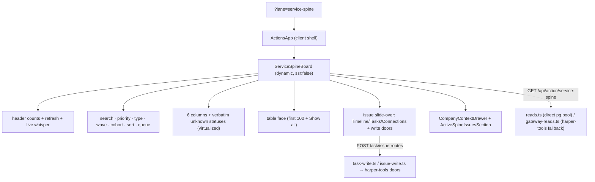
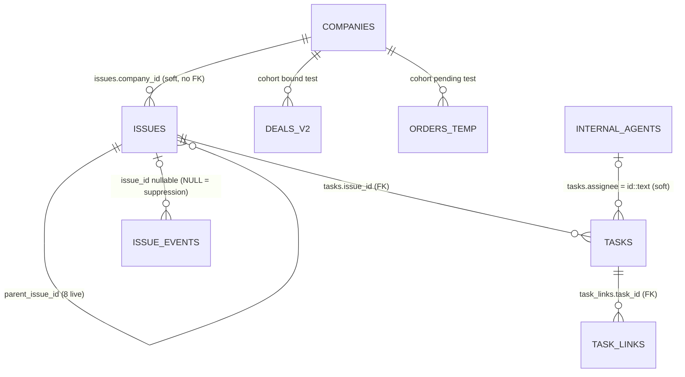

# Service Spine — source audit dossier

Canonical synthesis of the five-agent audit of the Service Spine feature in
`Tatch-AI/harper-coi-workbench` ("HCW"), produced for the Step Bro
implementation. Full evidence lives in `docs/service-spine/agents/1..5-*.md`;
this document is the contract of record. Where this dossier and an agent
report disagree, this dossier wins (it reflects the lead's direct source
inspection).

## 0. Pinned source

| Fact | Value |
|---|---|
| Repository | https://github.com/Tatch-AI/harper-coi-workbench |
| Default branch | `main` |
| Pinned commit | `718064e5dd1d78f02d4d54a3a0a5d8525fac83e4` |
| Commit time | 2026-08-18 20:09:26 -0700 |
| Commit title | "The umbrella line's bare code is a line on the Assign-IQ taxonomy, …" |
| Audit checkout | detached worktree at `/tmp/hcw-audit-718064e5` (read-only; source repo untouched) |
| Live DB observation window | 2026-08-19 17:47–17:56 UTC, cross-validated via Supabase MCP (`user-supabase`, SELECT-only) and Harper Tools MCP (`user-harper-tools`, read-only) |
| Live deployed route | `https://actions-parallel.bigbrother.harperinsure.com/?lane=service-spine` — **not** inspected in a browser (no authorized browser tooling in this environment); deployed behavior established from source + its pinning tests |

No source-repo files or production rows were modified at any point.

## 1. Route and component graph (summary)

`?lane=service-spine` resolves through `parseAppState`
(`src/lib/actions/url-state.ts:251`) against registry-derived `KNOWN_LANES`;
the lane is registered in `src/lib/lanes.ts:1169–1186` (`SERVICE_SPINE_LANE`,
label "Service spine", flat — no areas/actions). Invalid lanes degrade to
Home. Auth: Clerk + `@harperinsure.com` (`requirePageAccess` /
`requireUser`); no per-lane gate, no role model.

Full component/file inventory: agents/1 §2. Key laws:

- Board sub-state (view, filters, open issue, loaded window) is **never URL
  state** in the source; Back exits the lane. (Step Bro deliberately
  improves this — see design doc.)
- The board is offset-paged: 500 rows/page ordered
  `updated_at DESC, id DESC`, client auto-walks 4 pages (the "2,000 loaded"
  budget), 12 s keep-fresh poll re-reads page 0 only, pages folded by issue
  id (earlier page wins).
- Two controls the task brief expected **do not exist**: a closed-item
  toggle (the Closed column is always shown) and any "combine waiting"
  control (the two waiting columns are never merged; the nearest artifact is
  the `human+ai` queue mode).

## 2. Entity dictionary (authoritative tables)

All spine tables live in schema `service` on the Harper prod Postgres. DDL
is owned outside HCW (harper-tools/BigBrother side); no HCW migration
defines them. RLS is **disabled** on all four (critical advisor finding —
reported, not remediated here). No soft deletes anywhere; terminality is
status-based.

| Table | Rows (2026-08-19) | PK | Key columns / constraints |
|---|---|---|---|
| `service.issues` | 3,855→3,856 | `id` bigint identity | `company_id` (soft ref → `public.companies`, **no FK**, 0 orphans); `issue_type` free text (13 live values); `goal`; `status` CHECK ∈ {open, waiting_customer, waiting_third_party, blocked, resolved, cancelled}; `blocking` CHECK ∈ {blocking, non_blocking}; `origin` CHECK ∈ {deterministic, ai, human, viper, portal, financing}; `correlation_key` (UNIQUE with origin where non-null; 1,449 null); `priority` CHECK P0–P5; `sla_due_at`; `parent_issue_id` self-FK (8 rows); `latest_summary`, `last_communication_summary`, `resolution_summary`; `opened_at`, `updated_at` (board sort key), `resolved_at`; `ask_ledger`/`promise_ledger` jsonb (unread by any UI) |
| `service.tasks` | 7,616 | `id` bigint identity | `issue_id` FK NOT NULL; `company_id` denormalized (0 mismatches); `title`; `owner_kind` CHECK ∈ {agent, human}; `status` CHECK ∈ {todo, in_progress, waiting, done, cancelled}; `assignee` text = `internal_agents.id` as text (101 ids, 16 legacy names, 7,502 null); `lane_skill`, `gate_label`, `sla_due_at`; `draft_ref`/`hta_card_ref`/`detail` jsonb (PII — not rendered by the UI); `created_at`, `updated_at`, `completed_at` |
| `service.task_links` | 422 | `id` | `task_id` FK; UNIQUE (task_id, link_kind, link_ref); kinds live: blocked_by_task 300, subjectivity_item 118, subjectivity_draft 4 |
| `service.issue_events` | 159,886+ (~140k/week growth) | `id` | `issue_id` FK **nullable** — NULL rows are exactly the `signal_suppressed` suppressions (33,882); `company_id` NOT NULL; `kind` CHECK, 17 values (`comment` 95k largest; `reopened` legal but 0 rows); `payload` jsonb (PII possible); `actor`; `at` |

Supporting joins: `public.companies` (name), `public.deals_v2` +
`public.orders_temp` (cohort CASE), `public.internal_agents` (assignee
directory). Legacy `public.service_logs` (65,899 rows) is a **separate
ledger** read by other lanes; the spine lane never reads it. Bridge is
soft text keys (`svc:issue:{id}` projections + shared correlation keys);
only harper-tools' `service_query` merge surface unifies them (and it
double-serves mirrored items — flagged, agents/2 §8 D2).

Live enum distributions (both tools agree; agents/2 §6): status open 2,309 /
resolved 718 / blocked 329 / waiting_customer 243 / waiting_third_party 173 /
cancelled 83; priority P2 1,263 / P1 1,255 / P0 917 / P3 359 / P4 51 / P5 10;
origin ai 2,860 / deterministic 738 / portal 223 / human 34; 13 issue_types
(general_request 759, cancellation 741, policy_delivery 500, …).

## 3. Join graph

- One company holds many issues (2,608 companies / 3,856 issues; max 12;
  517 companies hold >1 open issue).
- **No first-class order/deal relation on issues** — order identity rides
  `correlation_key` text and task `detail` JSON only.
- Stable key for URLs/React keys: `service.issues.id` (bigint identity,
  never reused). Dedup law at mint: UNIQUE (origin, correlation_key) where
  key non-null.
- Never join by company name; `company_id` is the join key.

## 4. Field lineage (UI → column)

Complete table: agents/2 §5. Load-bearing derivations, verified directly in
source:

| UI concept | Source of truth | Law (exact, from source) |
|---|---|---|
| Kanban column | `issues.status` + events | `spineColumnOf`: terminal (`resolved`/`cancelled`) → `closed`; else `closureProposed === true` → `closure-proposed`; else status verbatim; **unknown status becomes its own appended column** (`ServiceSpineBoard.tsx:310–314`) |
| Terminal set | `labels.ts:22` | exactly `["resolved","cancelled"]`, single spelling repo-wide (pinned test) |
| Status labels | `labels.ts:28–44` | open→Open, waiting_customer→"Waiting on customer", waiting_third_party→"Waiting on third party", blocked→Blocked, resolved→Resolved, cancelled→Cancelled; unknown → underscores-to-spaces |
| `closureProposed` | `issue_events.kind='closure_proposed'` | `bool_or` per issue (list LATERAL / detail window) |
| `hasDraft` ("draft" pill) | `issue_events.kind='draft_created'` | `bool_or` per issue |
| Task progress `open/total` | `service.tasks` | open = `status NOT IN ('done','cancelled')`; split by `owner_kind` |
| Open human assignees | `tasks.assignee` on open human tasks | id resolved via directory to {name, email} match tokens; unknown token passes through raw (`my-queue.ts:51–60`) |
| Cohort tag (Pending/Active/Others) | `deals_v2` + `orders_temp` | CASE: no company → NULL; bound exists (non-deleted deal, non-empty `policy_number` — `boundPolicyDealPredicate`, no stage exclusion) → FALSE (Active; bound wins); else live pending order (not deleted, `order_complete IS DISTINCT FROM TRUE`, no/blank `lost_reason`, and no live deal on the order OR a live deal with blank policy number in a non-dead stage) → TRUE (Pending); else NULL (Others, untagged) (`reads.ts:69–118`) |
| Wave | `issues.correlation_key` | prefix before first `:` matched on `/(\d{4})(\d{2})(\d{2})$/` → `MMDD` (`waveOf`) |
| SLA chip | `issues.sla_due_at` | live countdown; amber < 4 h, red once breached; terminal/absent/unparseable → no chip |
| Search | loaded rows | case-insensitive substring over companyName, companyId, id, goal, issueType (+label), status (+label), priority, correlationKey, latestSummary, origin |
| Queue filter | tasks-derived tokens | `mine` = any open-human token matches viewer name (`viewerNameMatches`) or exact email; `human` = humanOpen>0; `ai` = agentOpen>0; `human+ai` = either; `person:X` = exact lowercased token equality (`my-queue.ts:123–144`) |
| Sort | — | `recency` = server order (updated_at DESC, id DESC); `priority` = `localeCompare` (lexicographic, P0 first) then updatedAt DESC |
| Origin | `issues.origin` | never a visible badge — meta fold + search haystack only |

## 5. Status and workflow state machine

Raw statuses: `open | waiting_customer | waiting_third_party | blocked |
resolved | cancelled` (DB CHECK = membership only; **no transition
constraint or trigger exists anywhere**). `closure-proposed` is a UI
overlay derived from events, not a status. Full Mermaid diagram: agents/3
§3. Essentials:

- Waiting/blocked/unblock/reopen transitions are **agent-side only** (no
  HCW door; `reopened` has a CHECK slot and zero rows — provably no door).
- Human doors produce exactly: task `→ done` (complete), task assignee
  change (assign), issue `→ resolved` / `→ cancelled` (resolve/cancel with
  required summary ≥ 3 chars). The human Resolve **is** the closure review
  act for the `closure_proposed` overlay.
- Agent auto-closure exists (`auto_closed` events, 401 rows).
- Task completion does **not** auto-move issue status in any HCW path.

## 6. Mutation contract and permissions (summary)

Six mutations, all via the harper-tools gateway (HCW contains **zero** SQL
INSERT/UPDATE against `service.*`; its direct pool is session-pinned
read-only, fail-closed). Full contract table: agents/3 §2.

| Action | Route | Far command | Applied status |
|---|---|---|---|
| Assign human task | `POST /api/action/service-spine/task {action:"assign"}` | `service task assign` (persists `internal_agents` id) | `assigned` |
| Complete human task | same `{action:"complete"}` | `service task transition status:"done"` | `transitioned` |
| Resolve issue | `POST /api/action/service-spine/issue {action:"resolve", summary}` | `service issue resolve` | `closed` |
| Cancel issue | same `{action:"cancel"}` | same command | `closed` |
| Feedback thumb | `POST /api/action/feedback` (verdict `other`, never stamps ledger) | direct INSERT into `team_actions.feedback_log` | — |
| Feedback retract | `DELETE /api/action/feedback?id=` (filer only) | DELETE own row | — |

Cross-cutting laws: Clerk + employee-domain gate, no roles; far-side enable
gates `HARPER_TOOLS_ENABLE_SERVICE_ISSUE_WRITE` (default **off**) and
`…_DRY_RUN` (default **on**) mean unarmed deploys answer `held` ("…not
turned on for this deploy yet. Nothing was changed."); **no idempotency
keys** on task/issue writes; mutations never retry; transport
failure/unrecognized status ⇒ `unknownOutcome` ⇒ UI locks the control for
the panel's life; `conflict` ⇒ re-read copy; audit rows land best-effort in
HCW's own `team_actions.action_log` per attempt; the far side writes its own
`service.issue_events` receipt for applied writes.

## 7. Count semantics

| Figure | Source | Semantics |
|---|---|---|
| Header "issues" + per-status dots | `SELECT status, count(*) FROM service.issues GROUP BY status` | whole ledger, exact, page 0 only (continuations answer `summary: null`; client keeps page one's copy) |
| Header agent/human tasks open/total | whole-table `GROUP BY owner_kind, status` | open = not done/cancelled |
| Header events / suppressed | whole-table count; suppressions = `issue_id IS NULL` | exact |
| `counted` (paging receipt) | sum of the status GROUP BY | recomputed every page/tick; the walk's stopping rule; `hasMore = offset + served < counted` |
| "N issues loaded" | client | folded window length |
| Column counts, "X of Y issues" filter line | client | lengths over the filtered **loaded** set |
| Gateway-fallback exception | folded from ≤200 served rows; suppressions hardcoded 0 | understated by construction, ceiling named on screen |

Per-issue tallies are exact LATERAL/window aggregates; a capped timeline
page still reports the true `eventCount` (window functions run before the
LIMIT). Nothing uses approximate counts.

## 8. Read query catalog (contract of record)

Verified directly in `src/lib/service-spine/reads.ts` at the pinned commit:

1. **Board page** — `ISSUES_SELECT` (agents/2 §4.1): issues LEFT JOIN
   companies, LATERAL task tally (counts + `open_human_assignees` array),
   LATERAL event tally (`has_draft`, `closure_proposed`, `event_count`,
   `last_event_at`), inline cohort CASE; `ORDER BY i.updated_at DESC, i.id
   DESC LIMIT 500 OFFSET $n`; offset ≥ counted short-circuits ("offset
   wall"). Plus the three summary aggregates (page 0) and the status count
   (every page).
2. **Company open issues** — same SELECT + `WHERE company_id = $2 AND
   status <> ALL(terminal) ORDER BY updated_at DESC LIMIT 50`.
3. **Issue detail** — head `SELECT i.*, company_name, cohort CASE WHERE id
   = $1`; timeline `SELECT …, count(*) OVER (), bool_or(…) OVER () FROM
   issue_events WHERE issue_id = $1 ORDER BY at DESC, id DESC LIMIT 500`
   (client re-sorts oldest-first, `eventsTruncated = total > served`);
   tasks by `created_at ASC`; links joined through tasks.
4. **Assignee directory** — `internal_agents` via harper-tools `ops sql`,
   30-minute cache.

Response shapes: `ServiceSpineIssueRow`, `ServiceSpineSummary`,
`ServiceSpinePaging`, `ServiceSpineIssueDetail` (`reads.ts:54–225`) — the
Step Bro domain model mirrors these (see design doc).

## 9. Refresh and consistency model

- Reads are `force-dynamic`, uncached, no subscriptions; polling only.
- 12 s keep-fresh tick re-reads page 0 and folds by id over held pages
  (earlier page wins — the tick's copy is freshest). Manual Refresh
  re-reads every loaded offset. Detail refresh re-reads issue + window.
- Offset paging over `updated_at DESC` with no snapshot: duplicates are
  folded out client-side; **gaps are not structurally prevented** — a row
  touched mid-walk can be skipped; recovery is count-checked Load-more
  retries, honestly worded in `SPINE_WALK_NOTE`. Source names keyset paging
  on `(updated_at, id)` + a first-page fence as the upgrade path
  (`reads.ts` "ponytail" note; agents/4 §2 and §8.1).
- Cost model (live EXPLAIN, agents/4 §3): page one costs 528.8 ms because
  both LATERALs fold **all 3,856 issues before the sort** — there is no
  `(updated_at DESC, id DESC)` index. The events LATERAL is 79% of page IO.
  Growth: issues ~1,650/week, events ~140k/week (ledger doubling ~monthly).

## 10. Performance pins inherited as budgets

- ≤ 500 rows / ≤ 420 KB raw / ≤ 16 KB gzip per list answer (measured
  382 KB / 12.7 KB); timeline cap 500 events with named truncation; table
  face bounded (source: 100 + Show all); kanban virtualized (~160 px
  estimate, overscan 4, one card per virtual row).

## 11. Flagged discrepancies and open questions (not guesses)

1. Lane registry blurb still says "Read-only" while the board ships write
   doors (documented in-code as "PENDING DR's sign-off").
2. Summary counts mean different things on the direct vs gateway read path
   (whole-ledger vs served-rows; suppressions hardcoded 0 on gateway).
3. `service_query list_issues` (MCP merge surface) double-serves work
   mirrored across both ledgers; the `open_issues_by_stage` pack suppresses
   ~729 legacy rows by a server-side rule not recoverable from the pinned
   repo. Neither affects HCW or Step Bro (neither app consumes that merge
   surface for the spine lane).
4. The `stage` values (`G1`–`G6`, `awaiting_signature`, …) served by
   harper-tools are server-side derivations; no such column exists.
5. RLS disabled on all four spine tables (critical, schema owner's to fix);
   `issues.company_id` lacks a declared FK; `service_logs.priority` holds
   the literal string `'NULL'` on 35,245 rows (legacy only).
6. Priority sort is lexicographic — correct for `P0…P5`, wrong for any
   future non-`P<n>` value.
7. Filter option sets in the source are loaded-window-derived; options that
   exist only on unloaded pages are not offered until walked.
